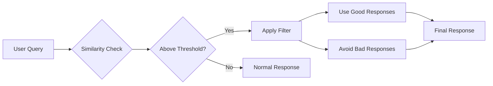

# Answer Filters Overview

Answer Filters are a powerful feature in PLai Framework that allow you to define specific response patterns for your agents. They enable you to control what your agent should or shouldn't say when users ask certain types of questions, ensuring consistent, accurate, and brand-appropriate responses.

## What are Answer Filters?

Answer Filters act as intelligent guards for your agent's responses. They work by:

1. **Detecting specific query patterns** that match your defined triggers
2. **Evaluating the similarity** between user queries and your filter definitions
3. **Guiding the agent** to use good responses or avoid bad responses

Think of Answer Filters as training wheels that help your agent stay on track, especially for critical topics where consistency and accuracy matter most.

<CardGroup cols={2}>
  <Card title="Control Responses" icon="message-check">
    Define exactly what your agent should say for specific queries
  </Card>
  <Card title="Prevent Mistakes" icon="shield-check">
    Block inappropriate or incorrect responses before they reach users
  </Card>
  <Card title="Brand Consistency" icon="building">
    Ensure responses align with your brand voice and policies
  </Card>
  <Card title="Quality Assurance" icon="badge-check">
    Maintain high-quality, accurate information delivery
  </Card>
</CardGroup>

---

## How Answer Filters Work

Answer Filters operate using a similarity-based matching system:



### Key Components

<Tabs>
  <Tab title="Queries">
    **Definition**: Example questions or topics that trigger this filter.
    
    **Purpose**: Help the system identify when to apply the filter based on user input similarity.
    
    **Example**:
    ```
    - "What are your refund policies?"
    - "Can I return this product?"
    - "How do I get my money back?"
    ```
    
    These query examples train the filter to recognize similar questions from users.
  </Tab>
  <Tab title="Good Responses">
    **Definition**: Approved, preferred responses for the matched queries.
    
    **Purpose**: Guide the agent toward giving these specific answers when the filter is triggered.
    
    **Example**:
    ```
    - "We offer a 30-day money-back guarantee on all products."
    - "You can initiate a return through your account dashboard."
    - "Refunds are processed within 5-7 business days."
    ```
    
    The agent will be encouraged to incorporate this information in its response.
  </Tab>
  <Tab title="Bad Responses">
    **Definition**: Responses that should be avoided or blocked.
    
    **Purpose**: Prevent the agent from saying specific things that could be harmful, incorrect, or off-brand.
    
    **Example**:
    ```
    - "We don't offer refunds." (if you do offer them)
    - "Just contact support." (too vague)
    - "I don't know our refund policy." (unhelpful)
    ```
    
    The agent will actively avoid these response patterns.
  </Tab>
  <Tab title="Trigger Threshold">
    **Definition**: Similarity score (0.0 - 1.0) required to activate the filter.
    
    **Purpose**: Control how closely a user's question must match your examples to trigger the filter.
    
    **Default**: 0.5 (50% similarity)
    
    **Scale**:
    - **0.3 - 0.4**: Lenient (triggers easily, broad matching)
    - **0.5 - 0.6**: Moderate (balanced, default)
    - **0.7 - 0.9**: Strict (only very similar queries trigger)
  </Tab>
</Tabs>

---

## Use Cases

Answer Filters excel in scenarios where consistency and accuracy are crucial:

### 1. Policy & Compliance

<Info>
Ensure your agent always provides accurate information about company policies, legal requirements, or compliance matters.
</Info>

**Example: Return Policy Filter**
```yaml
Queries:
  - "What is your return policy?"
  - "Can I return items?"
  - "How do returns work?"

Good Responses:
  - "We accept returns within 30 days of purchase with original packaging."
  - "Items must be unused and in original condition."
  - "Refunds are issued to the original payment method within 5-7 business days."

Bad Responses:
  - "All sales are final." (incorrect)
  - "I'm not sure about our return policy." (unhelpful)
  - "You'll have to ask someone else." (deflecting)
```

---

### 2. Pricing & Billing

<Warning>
Critical for preventing misinformation about costs, pricing tiers, or billing processes.
</Warning>

**Example: Pricing Filter**
```yaml
Queries:
  - "How much does it cost?"
  - "What are your prices?"
  - "Do you have a free plan?"

Good Responses:
  - "Our Basic plan starts at $29/month."
  - "We offer three tiers: Basic ($29), Pro ($79), and Enterprise (custom pricing)."
  - "Yes, we have a 14-day free trial with no credit card required."

Bad Responses:
  - "It's free." (if not accurate)
  - "Prices vary." (too vague)
  - "I don't know the pricing." (unhelpful)
```

---

### 3. Brand Voice & Messaging

<Note>
Maintain consistent brand personality and messaging across all interactions.
</Note>

**Example: Brand Tone Filter**
```yaml
Queries:
  - "Who are you?"
  - "Tell me about your company"
  - "What makes you different?"

Good Responses:
  - "We're a customer-first company dedicated to making AI accessible to everyone."
  - "Our mission is to empower businesses with intelligent automation."
  - "We combine cutting-edge technology with exceptional support."

Bad Responses:
  - "We're just another AI company." (weak positioning)
  - "I don't know much about the company." (not brand-aligned)
  - Generic corporate speak that doesn't match your brand
```

---

### 4. Technical Support

**Example: Troubleshooting Filter**
```yaml
Queries:
  - "My account won't log in"
  - "I forgot my password"
  - "Can't access my account"

Good Responses:
  - "Click 'Forgot Password' on the login page to reset your password."
  - "Check your email for a password reset link (it may take a few minutes)."
  - "If you don't receive the email, check your spam folder."

Bad Responses:
  - "Your account is probably locked." (assumption)
  - "Just try again later." (not helpful)
  - "Contact IT support." (deflecting when self-service is available)
```

---

### 5. Sensitive Topics

<Warning>
Handle sensitive or controversial topics with predefined, carefully crafted responses.
</Warning>

**Example: Data Privacy Filter**
```yaml
Queries:
  - "Do you sell my data?"
  - "How do you use my information?"
  - "Is my data safe?"

Good Responses:
  - "We never sell your personal data to third parties."
  - "Your data is encrypted and stored securely in compliance with GDPR."
  - "You can view our full privacy policy at [link]."

Bad Responses:
  - "We might share some data." (vague and concerning)
  - "Don't worry about it." (dismissive)
  - "I can't answer privacy questions." (evasive)
```

---

## Benefits of Answer Filters

<AccordionGroup>
  <Accordion title="Consistency" icon="equals">
    **Ensure uniform responses** across all user interactions for the same questions.
    
    - Same information every time
    - No contradictory answers
    - Reliable user experience
  </Accordion>
  <Accordion title="Accuracy" icon="bullseye">
    **Guarantee correct information** for critical topics.
    
    - Prevent hallucinations on important topics
    - Override model uncertainties
    - Maintain factual accuracy
  </Accordion>
  <Accordion title="Compliance" icon="scale-balanced">
    **Meet legal and regulatory requirements** with consistent messaging.
    
    - Legal disclaimer compliance
    - GDPR/privacy law adherence
    - Industry-specific regulations
  </Accordion>
  <Accordion title="Brand Protection" icon="shield">
    **Protect your brand reputation** by controlling sensitive responses.
    
    - Prevent off-brand messages
    - Avoid PR issues
    - Maintain professional tone
  </Accordion>
  <Accordion title="Quality Control" icon="badge-check">
    **Improve response quality** for common questions.
    
    - Better than generic AI responses
    - Incorporate domain expertise
    - Reduce need for human intervention
  </Accordion>
</AccordionGroup>

---

## When to Use Answer Filters

<Tabs>
  <Tab title="✅ Good Use Cases">
    **Answer Filters are ideal for:**
    
    - 📋 Company policies (returns, privacy, terms)
    - 💰 Pricing and billing information
    - 🔒 Security and compliance topics
    - 🏢 Brand messaging and positioning
    - 🆘 Critical troubleshooting steps
    - 📞 Contact information and escalation paths
    - ⚖️ Legal disclaimers and requirements
    - 🎯 FAQs with specific approved answers
    
    **Characteristics:**
    - High-stakes information
    - Needs to be consistent
    - Cannot be "creative" or varied
    - Subject to legal/compliance review
  </Tab>
  <Tab title="❌ When Not to Use">
    **Answer Filters are NOT ideal for:**
    
    - 💬 General conversation and chitchat
    - 🎨 Creative content generation
    - 🔄 Dynamic, context-dependent responses
    - 📊 Data analysis and interpretation
    - 🤔 Open-ended brainstorming
    - 📝 Long-form content creation
    - 🎓 Educational explanations (unless very specific)
    
    **Why:**
    - Too restrictive for creative tasks
    - Context varies too much
    - User needs personalized responses
    - Information changes frequently
  </Tab>
  <Tab title="⚖️ Consider Carefully">
    **Use with caution for:**
    
    - 🔄 Frequently changing information
    - 🌍 Multi-language scenarios (requires translation)
    - 🎨 Nuanced topics requiring context
    - 📈 Metrics and numbers that update often
    
    **Tips:**
    - Update filters when information changes
    - Consider using datasources instead for dynamic data
    - Test thoroughly in multiple contexts
    - Monitor for unintended triggering
  </Tab>
</Tabs>

---

## Answer Filters vs. Other Approaches

Understanding when to use Answer Filters versus other PLai Framework features:

| Feature | Best For | Answer Filters | System Prompt | Datasources |
|---------|----------|----------------|---------------|-------------|
| **Specific FAQs** | Exact, consistent answers | ✅ **Ideal** | ⚠️ Can drift | ⚠️ May vary |
| **General Knowledge** | Broad information | ❌ Too rigid | ✅ **Ideal** | ✅ **Ideal** |
| **Policies** | Legal/compliance | ✅ **Ideal** | ⚠️ May forget | ✅ Good |
| **Dynamic Data** | Real-time info | ❌ Static | ❌ No access | ✅ **Ideal** |
| **Brand Voice** | Tone and style | ⚠️ Limited | ✅ **Ideal** | ❌ Wrong tool |
| **Prohibited Content** | Block specific responses | ✅ **Ideal** | ⚠️ Can be overridden | ❌ Wrong tool |

<Info>
**Best Practice**: Combine multiple approaches for optimal results. Use Answer Filters for critical, specific content, System Prompts for general behavior, and Datasources for knowledge retrieval.
</Info>

---

## Limitations & Considerations

<Warning>
**Important Limitations to Understand:**
</Warning>

### Similarity Matching
Answer Filters use semantic similarity, not exact matching:
- User queries don't need to match exactly
- Similar phrasings will trigger the same filter
- Very creative phrasings might not trigger

### Not a Hard Block
Answer Filters guide the agent but don't completely override its behavior:
- Agents can still deviate slightly from good responses
- Answer Filters influence but don't guarantee exact wording
- For absolute control, consider using Structured Output mode

### Maintenance Required
- Keep filters updated as policies change
- Review and refine based on actual usage
- Remove outdated filters promptly

### Performance Impact
- Too many filters can slow response time slightly
- Each filter adds processing overhead
- Aim for 10-20 filters per agent (not a hard limit)

---

## Best Practices

<AccordionGroup>
  <Accordion title="Start Small">
    **Begin with your most critical topics**
    
    - Identify 3-5 critical topics first
    - Test thoroughly before adding more
    - Expand based on actual user interactions
  </Accordion>
  <Accordion title="Be Specific">
    **Clear, detailed definitions work best**
    
    - Provide multiple query examples (3-5 per filter)
    - Write concrete good/bad responses
    - Avoid vague or ambiguous language
  </Accordion>
  <Accordion title="Test Thoroughly">
    **Validate filter behavior before deployment**
    
    - Test with various phrasings
    - Check edge cases
    - Monitor initial interactions closely
  </Accordion>
  <Accordion title="Monitor & Iterate">
    **Continuously improve your filters**
    
    - Review agent conversations regularly
    - Add new query examples as you discover them
    - Refine responses based on user feedback
  </Accordion>
  <Accordion title="Document Your Answer Filters">
    **Keep track of why filters exist**
    
    - Note the business reason for each filter
    - Document expected behavior
    - Set reminders to review periodically
  </Accordion>
</AccordionGroup>

---

## Getting Started

Ready to create your first Answer Filter?

<Steps>
  <Step title="Identify Critical Topics">
    List questions where consistency is crucial
  </Step>
  <Step title="Draft Responses">
    Write approved responses for each topic
  </Step>
  <Step title="Create Filter">
    Navigate to the Answer Filters tab and click "Create Filter"
  </Step>
  <Step title="Test Behavior">
    Test with multiple query variations
  </Step>
  <Step title="Monitor & Adjust">
    Watch real conversations and refine as needed
  </Step>
</Steps>

---

## Next Steps

<CardGroup cols={2}>
  <Card title="Creating Answer Filters" icon="plus" href="/agents/answer-filters/creating-answer-filters">
    Step-by-step guide to creating your first filter
  </Card>
  <Card title="Managing Answer Filters" icon="list-check" href="/agents/answer-filters/managing-answer-filters">
    Learn to edit, update, and delete filters
  </Card>
  <Card title="Agent Settings" icon="sliders" href="/agents/settings">
    Configure other agent features
  </Card>
  <Card title="Analytics" icon="chart-line" href="/agents/analytics/overview">
    Monitor how filters affect conversations
  </Card>
</CardGroup>

---

## Common Questions

<AccordionGroup>
  <Accordion title="How many Answer Filters can I create per agent?">
    There's no hard limit, but we recommend keeping it under 50 filters per agent for optimal performance. Focus on quality over quantity – a few well-crafted filters are more effective than many vague ones.
  </Accordion>
  <Accordion title="Can filters conflict with each other?">
    If multiple filters match the same query, the system will consider all applicable filters. This usually works well, but you should test to ensure filters complement rather than contradict each other.
  </Accordion>
  <Accordion title="Do Answer Filters work in all languages?">
    Yes, Answer Filters work with multilingual agents. However, you'll need to create separate filters for each language or use the Language Detection feature to maintain consistency across languages.
  </Accordion>
  <Accordion title="Can I export/import filters between agents?">
    Currently, filters are agent-specific and cannot be bulk exported/imported. However, you can manually recreate filters on different agents. Bulk management features are on our roadmap.
  </Accordion>
  <Accordion title="What's the difference between Answer Filters and Guardrails?">
    **Answer Filters** guide specific responses to specific queries. **Guardrails** enforce broader safety and compliance rules across all interactions. Use both for comprehensive control.
  </Accordion>
</AccordionGroup>
