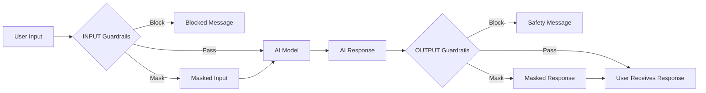

# Guardrails Overview

Guardrails are intelligent safety and content filtering mechanisms in PLai Framework that protect both your agents and users by detecting, blocking, or masking inappropriate, sensitive, or harmful content in real-time. Powered by Amazon Bedrock Guardrails, they provide enterprise-grade AI safety and compliance controls.

## What are Guardrails?

Guardrails act as protective barriers that monitor and control content flowing through your AI agents. They operate at two critical points:

<CardGroup cols={2}>
  <Card title="INPUT Guardrails" icon="shield-check">
    Filter and validate user messages before they reach the AI model
  </Card>
  <Card title="OUTPUT Guardrails" icon="shield-halved">
    Validate and filter AI-generated responses before delivery to users
  </Card>
</CardGroup>

Unlike Answer Filters which guide specific responses to queries, Guardrails enforce broader safety and compliance rules across **all interactions**, ensuring your agent operates within defined boundaries at all times.

---

## How Guardrails Work

Guardrails inspect content in real-time using advanced detection models:



### Action Types

Guardrails can take different actions when they detect policy violations:

<Tabs>
  <Tab title="Block">
    **Complete prevention of content**
    
    When sensitive content is detected, the guardrail completely blocks the message or response.
    
    **Best for:**
    - Hate speech
    - Explicit sexual content
    - Violent or harmful content
    - Prohibited topics (politics, religion)
    - Policy violations
    
    **Example:**
    ```
    User: "Tell me how to hack into..."
    Guardrail: BLOCKED
    Response: "I cannot assist with activities that could be harmful or illegal."
    ```
  </Tab>
  
  <Tab title="Mask (Anonymize)">
    **Redaction of sensitive information**
    
    Detects and masks personally identifiable information (PII) and sensitive data while allowing the conversation to continue.
    
    **Best for:**
    - Email addresses
    - Phone numbers
    - Credit card numbers
    - Social security numbers
    - Names and addresses
    - Other PII data
    
    **Example:**
    ```
    User: "My email is john.doe@example.com and my phone is 555-1234"
    After Masking: "My email is [EMAIL_REDACTED] and my phone is [PHONE_REDACTED]"
    ```
    
    <Info>
    Masking allows conversations to continue while protecting sensitive information from being processed or stored.
    </Info>
  </Tab>
</Tabs>

---

## Key Features

### 1. INPUT and OUTPUT Protection

<AccordionGroup>
  <Accordion title="INPUT Guardrails" icon="arrow-down-to-bracket">
    **Protect your AI model from harmful inputs**
    
    INPUT guardrails validate user messages before they reach the AI model:
    
    - **Filter malicious prompts**: Block prompt injection and jailbreak attempts
    - **Mask PII**: Remove sensitive user data before processing
    - **Block prohibited topics**: Prevent queries about restricted subjects
    - **Validate content safety**: Screen for harmful or inappropriate input
    
    **When to use:**
    - User-facing chatbots
    - Public-facing agents
    - Compliance-sensitive applications
    - Customer service bots
  </Accordion>
  
  <Accordion title="OUTPUT Guardrails" icon="arrow-up-from-bracket">
    **Ensure safe, compliant AI responses**
    
    OUTPUT guardrails validate AI-generated content before delivery to users:
    
    - **Prevent harmful outputs**: Block toxic, violent, or inappropriate responses
    - **Protect sensitive information**: Mask PII in AI-generated content
    - **Enforce brand safety**: Ensure responses meet brand guidelines
    - **Maintain compliance**: Verify regulatory compliance
    
    **When to use:**
    - Public content generation
    - Customer-facing communications
    - Regulated industries
    - Brand-sensitive applications
  </Accordion>
</AccordionGroup>

---

### 2. PII Detection and Masking

Guardrails can automatically detect and mask various types of personally identifiable information:

<CardGroup cols={3}>
  <Card title="Contact Information" icon="address-book">
    - Email addresses
    - Phone numbers
    - Physical addresses
    - Social media handles
  </Card>
  <Card title="Financial Data" icon="credit-card">
    - Credit card numbers
    - Bank account numbers
    - SSN/Tax IDs
    - Financial statements
  </Card>
  <Card title="Personal Identifiers" icon="id-card">
    - Full names
    - Date of birth
    - Driver's license numbers
    - Passport numbers
  </Card>
</CardGroup>

<Warning>
**Privacy & Compliance:**
PII masking helps you comply with regulations like GDPR, CCPA, HIPAA, and other data protection laws.
</Warning>

---

### 3. Default Guardrail

PLai Framework includes a **default guardrail** that automatically protects all agents from harmful INPUT content:

<Info>
**Default INPUT Guardrail:**

Automatically blocks user queries containing:
- 🚫 **Sexual content**: Explicit sexual material or inappropriate content
- 🚫 **Hate speech**: Discrimination, prejudice, or hateful content
- 🚫 **Insults**: Personal attacks or abusive language
- 🚫 **Politics**: Political opinions, debates, or partisan content
- 🚫 **Religion**: Religious debates or divisive religious content

**Status**: Always active on all agents by default
</Info>

The default guardrail provides baseline protection without requiring any configuration. You can create additional custom guardrails for specific needs.

---

### 4. On-Demand Creation

Guardrails are created **on-demand** based on your specific requirements:

<Steps>
  <Step title="Identify Protection Needs">
    Determine what content needs to be blocked or masked for your use case
  </Step>
  <Step title="Request Guardrail Creation">
    Guardrails are created through the Amazon Bedrock Guardrails service
  </Step>
  <Step title="Configure and Apply">
    Apply the guardrail to your agents with appropriate settings
  </Step>
  <Step title="Monitor and Adjust">
    Review guardrail performance and refine as needed
  </Step>
</Steps>

<Note>
Guardrails are powered by **Amazon Bedrock Guardrails**, providing enterprise-grade content filtering backed by AWS's advanced AI safety models.
</Note>

---

## Guardrail Scope

Guardrails can be configured at different organizational levels:

<Tabs>
  <Tab title="General Guardrails">
    **Available to all organizations**
    
    - Platform-wide default guardrail
    - Standard safety and compliance guardrails
    - Common PII masking rules
    - Industry-standard content filters
    
    **Characteristics:**
    - Maintained by PLai Framework
    - Automatically updated
    - Best practices built-in
    - No configuration required
    
    <Check>
    Ideal for getting started quickly with proven safety measures
    </Check>
  </Tab>
  
  <Tab title="Organization-Specific Guardrails">
    **Custom guardrails for your organization**
    
    - Custom content policies
    - Industry-specific compliance rules
    - Organization-specific PII handling
    - Brand-specific safety requirements
    - Custom prohibited topics
    
    **Characteristics:**
    - Fully customizable
    - Only available to your organization
    - Created on-demand
    - Tailored to your needs
    
    <Check>
    Perfect for specialized industries, unique compliance needs, or specific brand requirements
    </Check>
  </Tab>
</Tabs>

---

## Use Cases

### 1. Customer Service & Support

<Info>
Protect customer interactions and maintain professional communication standards.
</Info>

**Guardrails to implement:**
- **INPUT**: Block offensive language and inappropriate requests
- **INPUT**: Mask customer PII (phone, email, account numbers)
- **OUTPUT**: Prevent sharing of internal system information
- **OUTPUT**: Ensure professional, brand-aligned language

---

### 2. Healthcare & Medical Applications

<Warning>
HIPAA compliance requires strict protection of patient health information (PHI).
</Warning>

**Guardrails to implement:**
- **INPUT**: Mask all PHI (patient names, diagnoses, records)
- **INPUT**: Block requests for medical advice or diagnoses
- **OUTPUT**: Prevent disclosure of patient information
- **OUTPUT**: Block medical recommendations outside scope

---

### 3. Financial Services

<Warning>
PCI-DSS and financial regulations mandate protection of financial data.
</Warning>

**Guardrails to implement:**
- **INPUT**: Mask credit card numbers, account details, SSNs
- **INPUT**: Block fraudulent or suspicious requests
- **OUTPUT**: Prevent disclosure of account information
- **OUTPUT**: Ensure regulatory compliance in responses

---

### 4. Education & E-Learning

<Note>
Protect students and maintain appropriate educational environment.
</Note>

**Guardrails to implement:**
- **INPUT**: Block inappropriate content (sexual, violent, hateful)
- **INPUT**: Mask student PII (names, emails, student IDs)
- **OUTPUT**: Ensure age-appropriate responses
- **OUTPUT**: Prevent academic integrity violations

---

### 5. Content Moderation

**Guardrails to implement:**
- **INPUT**: Filter user-generated content for harmful material
- **INPUT**: Block spam and malicious content
- **OUTPUT**: Ensure community guidelines compliance
- **OUTPUT**: Maintain platform safety standards

---

## Benefits of Guardrails

<CardGroup cols={2}>
  <Card title="AI Safety" icon="shield-check">
    **Prevent harmful AI behavior**
    
    - Block toxic outputs
    - Prevent bias and discrimination
    - Stop misinformation
    - Ensure appropriate content
  </Card>
  
  <Card title="Privacy Protection" icon="user-shield">
    **Protect user privacy**
    
    - Automatic PII detection
    - Data masking and anonymization
    - Regulatory compliance
    - Reduced data exposure
  </Card>
  
  <Card title="Compliance" icon="scale-balanced">
    **Meet regulatory requirements**
    
    - GDPR compliance
    - HIPAA compliance
    - PCI-DSS compliance
    - Industry regulations
  </Card>
  
  <Card title="Brand Protection" icon="building-shield">
    **Safeguard your reputation**
    
    - Prevent PR incidents
    - Maintain brand voice
    - Control public messaging
    - Ensure professionalism
  </Card>
  
  <Card title="Risk Mitigation" icon="triangle-exclamation">
    **Reduce operational risks**
    
    - Limit legal liability
    - Prevent security incidents
    - Control information disclosure
    - Audit trail maintenance
  </Card>
  
  <Card title="User Trust" icon="handshake">
    **Build user confidence**
    
    - Demonstrate commitment to safety
    - Transparent data handling
    - Consistent behavior
    - Professional interactions
  </Card>
</CardGroup>

---

## Guardrails vs. Answer Filters

Understanding the difference between these two features:

| Feature | **Guardrails** | **Answer Filters** |
|---------|----------------|-------------------|
| **Purpose** | Safety & compliance enforcement | Response guidance for specific queries |
| **Scope** | All interactions | Specific query patterns |
| **Action** | Block or mask content | Guide response content |
| **Trigger** | Policy violations detected | Query similarity matching |
| **Granularity** | Broad safety rules | Specific Q&A pairs |
| **Technology** | Amazon Bedrock Guardrails | Semantic similarity |
| **Best For** | Content safety, PII protection, compliance | Consistent answers to FAQs |

<Info>
**Best Practice**: Use both Guardrails and Answer Filters together for comprehensive agent control. Guardrails provide safety boundaries, while Answer Filters ensure consistent, high-quality responses within those boundaries.
</Info>

---

## Limitations & Considerations

<AccordionGroup>
  <Accordion title="Detection Accuracy" icon="bullseye">
    **Understanding AI detection limits**
    
    Guardrails use advanced AI models but are not 100% perfect:
    - May occasionally miss sophisticated attempts to bypass filters
    - Can have false positives (blocking safe content)
    - Context-dependent detection may vary
    - Evolving adversarial techniques
    
    **Mitigation:**
    - Regular monitoring and review
    - Continuous model updates
    - Human oversight for critical applications
    - Multi-layered security approach
  </Accordion>
  
  <Accordion title="Performance Impact" icon="gauge-high">
    **Latency considerations**
    
    Guardrails add processing time to each interaction:
    - INPUT guardrails: +50-200ms
    - OUTPUT guardrails: +50-200ms
    - PII masking: +100-300ms
    - Multiple guardrails compound latency
    
    **Mitigation:**
    - Use only necessary guardrails
    - Optimize guardrail selection
    - Consider async processing where possible
    - Balance safety with performance needs
  </Accordion>
  
  <Accordion title="Language Support" icon="language">
    **Multi-language considerations**
    
    Guardrail effectiveness varies by language:
    - Best performance in English
    - Good support for major European languages
    - Limited support for some languages
    - Cultural context differences
    
    **Mitigation:**
    - Test thoroughly in target languages
    - Consider language-specific guardrails
    - Monitor performance by language
    - Adjust thresholds as needed
  </Accordion>
  
  <Accordion title="Context Sensitivity" icon="brain">
    **Understanding context limitations**
    
    Guardrails may struggle with:
    - Sarcasm and irony
    - Cultural nuances
    - Domain-specific terminology
    - Context-dependent appropriateness
    
    **Mitigation:**
    - Test with realistic scenarios
    - Provide feedback for improvement
    - Use domain-specific guardrails
    - Combine with human review
  </Accordion>
</AccordionGroup>

---

## Getting Started

Ready to implement Guardrails for your agents?

<Steps>
  <Step title="Assess Your Needs">
    Identify what content needs protection:
    - What are your compliance requirements?
    - What PII needs to be masked?
    - What topics should be prohibited?
    - What are your safety priorities?
  </Step>
  
  <Step title="Review Default Guardrail">
    Understand the built-in protection already active on your agents
  </Step>
  
  <Step title="Plan Custom Guardrails">
    Determine if you need organization-specific guardrails for:
    - Industry-specific compliance
    - Custom PII handling
    - Organization-specific policies
    - Brand-specific requirements
  </Step>
  
  <Step title="Request Creation">
    Work with your PLai administrator to create custom guardrails through Amazon Bedrock Guardrails service
  </Step>
  
  <Step title="Configure and Test">
    Apply guardrails to your agents and test thoroughly with realistic scenarios
  </Step>
  
  <Step title="Monitor and Refine">
    Review guardrail performance and adjust as needed
  </Step>
</Steps>

---

## Next Steps

<CardGroup cols={2}>
  <Card title="Configuration Guide" icon="gear" href="/agents/guardrails/configuration">
    Learn how to configure and apply Guardrails to your agents
  </Card>
  <Card title="Best Practices" icon="star" href="/agents/guardrails/best-practices">
    Discover expert tips for effective Guardrail implementation
  </Card>
  <Card title="API Reference" icon="code" href="/api-reference/guardrails">
    Explore the Guardrails API for programmatic control
  </Card>
  <Card title="Answer Filters" icon="filter" href="/agents/answer-filters/overview">
    Learn about complementary response control features
  </Card>
</CardGroup>

---

## Frequently Asked Questions

<AccordionGroup>
  <Accordion title="How does the default guardrail work?">
    The default INPUT guardrail is automatically active on all agents and blocks queries containing sexual content, hate speech, insults, politics, or religion. It runs before any custom guardrails and requires no configuration.
  </Accordion>
  
  <Accordion title="Can I disable the default guardrail?">
    The default guardrail provides essential safety protection and is always active. However, you can create custom guardrails with different policies for organization-specific needs.
  </Accordion>
  
  <Accordion title="How is PII detected and masked?">
    Guardrails use advanced pattern matching and AI models to detect PII such as emails, phone numbers, addresses, and financial data. Detected PII is replaced with tokens like [EMAIL_REDACTED] or [PHONE_REDACTED].
  </Accordion>
  
  <Accordion title="What happens when a guardrail blocks content?">
    When content is blocked, users receive a polite safety message indicating that the request cannot be fulfilled. The original content is logged for monitoring but not processed by the AI model.
  </Accordion>
  
  <Accordion title="How do I create a custom guardrail?">
    Custom guardrails are created through the Amazon Bedrock Guardrails service. Contact your PLai administrator or account manager to request creation of organization-specific guardrails.
  </Accordion>
  
  <Accordion title="Do guardrails work with all AI models?">
    Yes, guardrails operate independently of the underlying AI model. They filter content before and after model processing, working with any model supported by PLai Framework.
  </Accordion>
  
  <Accordion title="Can I see when guardrails are triggered?">
    Yes, guardrail activations are logged in your agent's analytics. You can monitor trigger frequency, blocked content patterns, and guardrail effectiveness.
  </Accordion>
  
  <Accordion title="What's the difference between blocking and masking?">
    **Blocking** completely prevents content from being processed (used for harmful content). **Masking** redacts specific sensitive information while allowing the conversation to continue (used for PII protection).
  </Accordion>
</AccordionGroup>
