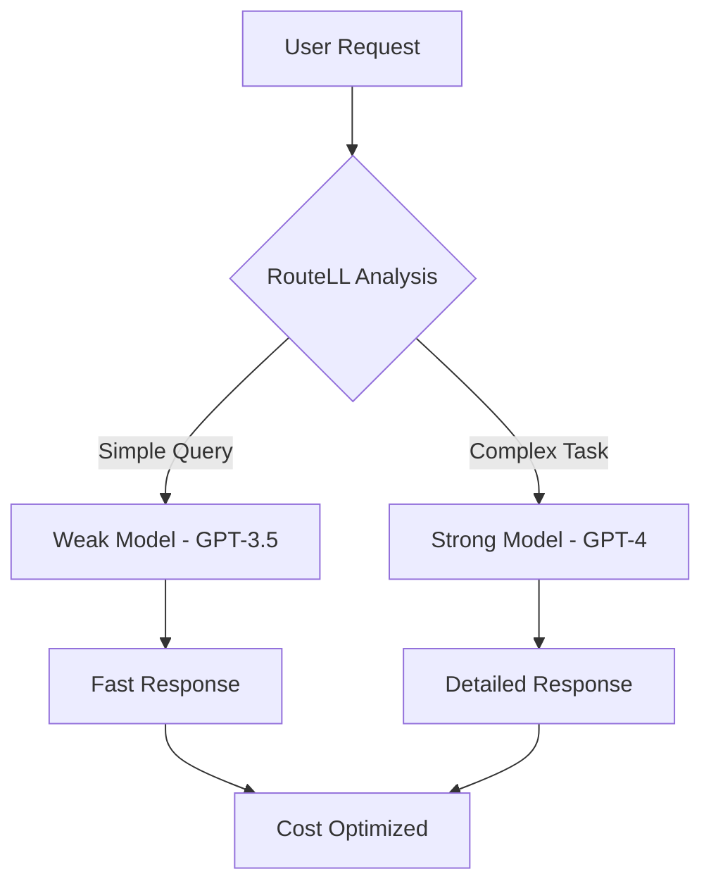

# Agents Overview

Agents are the core AI entities in PLai Framework. Each agent is a specialized AI assistant that can chat with users, use tools, access datasources, and execute complex workflows.

<Frame>
  
</Frame>

## What are Agents?

Agents in PLai Framework are intelligent AI assistants that can:

<CardGroup cols={2}>
  <Card title="Chat & Interact" icon="comments">
    Engage in natural language conversations with users
  </Card>
  <Card title="Use Tools" icon="wrench">
    Execute actions through connected tools and APIs
  </Card>
  <Card title="Access Data" icon="database">
    Query datasources and knowledge bases
  </Card>
  <Card title="Process Requests" icon="gear">
    Handle batch operations and complex workflows
  </Card>
</CardGroup>

## Agent Features

### Core Capabilities

Every agent in PLai Framework includes:

- **Natural Language Processing**: Powered by advanced LLMs
- **Tool Integration**: Connect to 6+ different tool types
- **Memory & Context**: Maintain conversation history and context
- **Customizable Personality**: Define behavior through system instructions
- **Multi-Modal Support**: Handle text, images, and other media types

### Advanced Features

<Tabs>
  <Tab title="Analytics">
    - Real-time conversation analytics
    - Performance metrics and insights
    - Custom reporting and filtering
    - Progress tracking for batch operations
  </Tab>
  <Tab title="Filters">
    - Answer filtering and validation
    - Content moderation controls
    - Response customization rules
    - Conditional logic implementation
  </Tab>
  <Tab title="Guardrails">
    - Safety and compliance controls
    - Content filtering mechanisms
    - Rate limiting and usage controls
    - Automated monitoring and alerts
  </Tab>
</Tabs>

## Agent Configuration

### Basic Settings

Each agent has fundamental configuration options:

<AccordionGroup>
  <Accordion title="Identity & Behavior">
    - **Name**: Human-readable agent identifier
    - **Description**: Purpose and capabilities summary
    - **System Instructions**: Core personality and behavior guidelines
    - **Avatar**: Visual representation for chat interfaces
  </Accordion>
  <Accordion title="Model Configuration">
    - **LLM Provider**: OpenAI, Anthropic, Together AI, Azure, etc.
    - **Model Selection**: GPT-4, Claude, Llama, and other models
    - **Temperature**: Response creativity and randomness
    - **Max Tokens**: Response length limitations
    - **RouteLL**: Smart model routing for cost optimization
  </Accordion>
  <Accordion title="Capabilities">
    - **Tools**: Available actions and integrations
    - **Datasources**: Knowledge bases and data access
    - **File Upload**: Document processing capabilities
    - **Voice Input**: Audio conversation support
  </Accordion>
</AccordionGroup>

## Agent Status & Management

### Agent States

<CardGroup cols={3}>
  <Card title="Active" icon="check-circle" color="#10b981">
    Agent is running and can handle requests
  </Card>
  <Card title="Inactive" icon="x-circle" color="#ef4444">
    Agent is paused and won't respond to requests
  </Card>
  <Card title="Processing" icon="clock" color="#f59e0b">
    Agent is busy processing batch operations
  </Card>
</CardGroup>

### Management Operations

Common agent management tasks:

- **Create**: Set up new agents with configuration
- **Update**: Modify settings, tools, and behavior
- **Clone**: Duplicate agents for testing or variants
- **Share**: Generate public or private sharing links
- **Delete**: Remove agents and associated data
- **Export**: Backup agent configurations

## Agent Types & Use Cases

### Customer Support Agents
```yaml
Purpose: Handle customer inquiries and support tickets
Tools: 
  - Knowledge Base Search
  - Ticket System API
  - Email Integration
Features:
  - Escalation to human agents
  - Sentiment analysis
  - Multi-language support
```

### Data Analysis Agents
```yaml
Purpose: Process and analyze data from various sources
Tools:
  - Database Connections
  - Code Interpreter
  - Visualization Tools
Features:
  - Automated reporting
  - Data insights generation
  - Chart and graph creation
```

### Content Creation Agents
```yaml
Purpose: Generate and edit content across formats
Tools:
  - Web Search (Perplexity AI)
  - Document Processing
  - Image Generation
Features:
  - Multi-format output
  - Fact-checking
  - Style consistency
```

### Research Agents
```yaml
Purpose: Gather and synthesize information from multiple sources
Tools:
  - Web Scraping
  - Academic Databases
  - Document Analysis
Features:
  - Source verification
  - Citation management
  - Summary generation
```

## Model Providers & Selection

PLai Framework supports multiple LLM providers:

<Tabs>
  <Tab title="OpenAI">
    - **GPT-4 Turbo**: Latest and most capable model
    - **GPT-4**: Balanced performance and cost
    - **GPT-3.5 Turbo**: Fast and cost-effective
    - **Usage**: Excellent for general chat and reasoning
  </Tab>
  <Tab title="Anthropic">
    - **Claude 3.5 Sonnet**: Advanced reasoning and analysis
    - **Claude 3 Haiku**: Fast responses, good for simple tasks
    - **Usage**: Great for complex analysis and safety
  </Tab>
  <Tab title="Together AI">
    - **Llama 3.1**: Open-source alternative
    - **Mixtral**: Mixture of experts architecture
    - **Usage**: Cost-effective for specialized tasks
  </Tab>
  <Tab title="Azure OpenAI">
    - **Enterprise Features**: Enhanced security and compliance
    - **Regional Deployment**: Data residency options
    - **Usage**: Enterprise and regulated environments
  </Tab>
</Tabs>

## RouteLL Integration

RouteLL automatically routes requests to the most appropriate model based on complexity and cost:



### RouteLL Benefits
- **Cost Optimization**: Use cheaper models for simple tasks
- **Performance**: Route complex queries to advanced models
- **Automatic**: No manual configuration required
- **Transparent**: Full visibility into routing decisions

## Getting Started

Ready to create your first agent?

<Steps>
  <Step title="Navigate to Agents">
    Go to the Agents section in your project dashboard
  </Step>
  <Step title="Click Create Agent">
    Use the "+" button or "Create Agent" button
  </Step>
  <Step title="Configure Basic Settings">
    Set name, description, and system instructions
  </Step>
  <Step title="Select Model">
    Choose your preferred LLM provider and model
  </Step>
  <Step title="Add Tools (Optional)">
    Connect tools to extend agent capabilities
  </Step>
  <Step title="Test & Deploy">
    Test your agent in chat and activate when ready
  </Step>
</Steps>

## Next Steps

<CardGroup cols={2}>
  <Card title="Create Your First Agent" icon="play" href="/agents/creating-agents">
    Step-by-step agent creation guide
  </Card>
  <Card title="Agent Settings" icon="settings" href="/agents/agent-settings">
    Configure advanced agent features
  </Card>
  <Card title="Analytics" icon="chart-line" href="/agents/analytics/overview">
    Monitor and analyze agent performance
  </Card>
  <Card title="First Agent Tutorial" icon="graduation-cap" href="/guides/first-agent">
    Complete walkthrough with examples
  </Card>
</CardGroup>

## Common Questions

<AccordionGroup>
  <Accordion title="How many agents can I create?">
    The number of agents depends on your subscription plan. Free plans typically allow 3 agents, while premium plans offer unlimited agents.
  </Accordion>
  <Accordion title="Can agents communicate with each other?">
    Currently, agents operate independently. Multi-agent workflows are on our roadmap for future releases.
  </Accordion>
  <Accordion title="What happens to conversation history?">
    Conversation history is stored securely and can be accessed through the analytics dashboard. Data retention policies vary by plan.
  </Accordion>
  <Accordion title="Can I export agent configurations?">
    Yes, agent configurations can be exported as JSON files for backup or migration purposes.
  </Accordion>
</AccordionGroup>