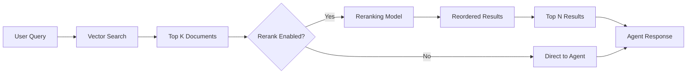

# Agent Settings

This guide provides a comprehensive overview of all configuration options available when setting up and managing your AI agents in PLai Framework. Agent settings are organized into four main tabs: Agent, Model, Datasources, and Tools.

## Overview

Agent settings allow you to customize every aspect of your AI agent's behavior, appearance, and capabilities. Each setting plays a crucial role in determining how your agent interacts with users, processes information, and executes tasks.

<CardGroup cols={2}>
  <Card title="Agent Tab" icon="user" href="#agent-configuration">
    Identity, behavior, and personality settings
  </Card>
  <Card title="Model Tab" icon="brain" href="#model-configuration">
    LLM provider, model selection, and advanced features
  </Card>
  <Card title="Datasources Tab" icon="database" href="#datasources-configuration">
    Knowledge base configuration and retrieval settings
  </Card>
  <Card title="Tools Tab" icon="wrench" href="#tools-configuration">
    Tool integration and execution parameters
  </Card>
</CardGroup>

---

## Agent Configuration

The Agent tab contains settings related to your agent's identity, appearance, and core behavior.

### Avatar

Upload a custom image to represent your agent in chat interfaces.

<Info>
**Supported Formats**: `.jpg`, `.jpeg`, `.png`  
**Recommended Size**: 512x512 pixels for optimal display
</Info>

**Use Cases:**
- Brand consistency across customer-facing agents
- Visual differentiation between multiple agents
- Enhanced user experience with personalized avatars

---

### Name

The human-readable identifier for your agent.

<ParamField path="name" type="string" required>
  Display name that appears throughout the interface
</ParamField>

**Best Practices:**
- Keep it clear and descriptive (e.g., "Customer Support Bot", "Data Analyst")
- Avoid special characters that might cause display issues
- Consider your branding and user-facing context

**Example:**
```
Marketing Content Assistant
```

---

### Description

A brief summary of your agent's purpose and capabilities.

<ParamField path="description" type="string" required>
  Explains what the agent does and when to use it
</ParamField>

**Best Practices:**
- Be specific about the agent's specialty
- Mention key capabilities or domains
- Keep it concise (1-2 sentences)

**Example:**
```
This agent is an expert at creating engaging marketing content, 
including blog posts, social media updates, and email campaigns.
```

---

### Name Slug

A unique, URL-friendly identifier for your agent.

<ParamField path="name_slug" type="string">
  Lowercase identifier with underscores (minimum 5 characters)
</ParamField>

**Format Requirements:**
- Lowercase letters and numbers only
- Use underscores to separate words
- Minimum 5 characters
- Must match pattern: `^[a-z0-9]+(?:_[a-z0-9]+)*$`

**Examples:**
```
✅ customer_support_agent
✅ data_analysis_bot
✅ marketing_assistant_v2

❌ CustomerSupport (uppercase not allowed)
❌ agent-name (hyphens not allowed)
❌ bot (too short)
```

---

### Core Agent

<Note>
**Availability**: This setting is only visible for Core Agents Organization accounts.
</Note>

<ParamField path="is_core_agent" type="boolean" default="false">
  Designates this agent as a core system agent
</ParamField>

Core agents have special privileges and are typically used for system-level operations.

---

### Prompt (System Instructions)

The system prompt defines your agent's personality, behavior guidelines, and response style.

<ParamField path="prompt" type="string" required>
  Instructions that guide the agent's behavior and responses
</ParamField>

**Components of a Good Prompt:**
1. **Role Definition**: Who the agent is
2. **Capabilities**: What it can do
3. **Constraints**: What it should/shouldn't do
4. **Style Guidelines**: How it should communicate
5. **Context**: Additional relevant information

<Tabs>
  <Tab title="Basic Example">
    ```
    You are a helpful customer support assistant for an e-commerce platform.
    
    Your role is to:
    - Answer questions about products, orders, and policies
    - Help troubleshoot common issues
    - Guide users through the return process
    
    Always be friendly, professional, and empathetic. If you don't know 
    something, admit it and offer to connect the user with a human agent.
    ```
  </Tab>
  <Tab title="Advanced Example">
    ```
    You are an AI Data Analyst specializing in business intelligence and 
    predictive analytics.
    
    ## Your Capabilities:
    - Analyze datasets and identify trends
    - Create visualizations and reports
    - Provide actionable business insights
    - Run SQL queries on connected databases
    
    ## Communication Style:
    - Be precise and data-driven
    - Use clear, jargon-free language
    - Always cite your sources
    - Provide confidence levels for predictions
    
    ## Constraints:
    - Never make up data or statistics
    - Always validate data quality before analysis
    - Respect data privacy and security guidelines
    - Escalate sensitive queries to human analysts
    
    ## Context:
    You have access to the company's sales database (2020-present) and 
    customer demographics data. Focus on actionable insights that drive 
    business decisions.
    ```
  </Tab>
  <Tab title="Markdown Editor">
    Click "Edit in Markdown Editor" for a full-screen editing experience with:
    - Syntax highlighting
    - Preview mode
    - Better formatting controls
    - Easier management of long prompts
  </Tab>
</Tabs>

<Warning>
**Important**: Changes to the prompt can significantly alter your agent's behavior. Always test thoroughly after updates.
</Warning>

---

### Initial Message (Intro Message)

The first message your agent sends when a new conversation starts.

<ParamField path="initial_message" type="string">
  Greeting message displayed at the start of conversations
</ParamField>

**Best Practices:**
- Be welcoming and friendly
- Set expectations for what the agent can do
- Keep it concise
- Consider adding a call-to-action

**Examples:**

<Tabs>
  <Tab title="Simple">
    ```
    Hi, how can I help you today?
    ```
  </Tab>
  <Tab title="Informative">
    ```
    Hello! I'm your marketing content assistant. I can help you create 
    blog posts, social media content, and email campaigns. What would 
    you like to work on today?
    ```
  </Tab>
  <Tab title="With Options">
    ```
    Welcome! I'm here to help you with:
    • Product questions
    • Order tracking
    • Returns and refunds
    
    What can I assist you with?
    ```
  </Tab>
</Tabs>

---

## Model Configuration

The Model tab contains all settings related to the language model powering your agent.

### Language Model Selection

Choose the AI model provider and specific model for your agent.

<ParamField path="llm_provider" type="string" required>
  AI provider (OpenAI, Anthropic, Google, etc.)
</ParamField>

<ParamField path="llm_model" type="string" required>
  Specific model within the selected provider
</ParamField>

**Available Providers:**
- **OpenAI**: GPT-4o, GPT-4.1, GPT-5
- **Anthropic**: Claude Sonnet, Claude Opus, Claude Haiku
- **Google**: Gemini Pro models, Gemini Flash models
- **Groq**: Llama models with ultra-fast inference
- **Together AI**: Open-source models (Llama, Mixtral)
- **RouteLLM**: Intelligent model routing

<Tabs>
  <Tab title="Selection Guide">
    | Use Case | Recommended Model | Reason |
    |----------|-------------------|---------|
    | Complex reasoning | GPT o1/o3 / Claude 4.x Opus | Best accuracy |
    | Fast responses | GPT-4.1 mini / Gemini 2.5 Flash | Low latency |
    | Cost optimization | RouteLLM | Automatic routing |
    | Long context | Claude 4.x Sonnet / Gemini 3 Pro | Large context window |
    | Structured output | GPT-4.x models / Gemini 3 Pro | Native support |
  </Tab>
</Tabs>

---

### RouteLLM Configuration

<Note>
**What is RouteLLM?**  
RouteLLM intelligently routes requests between a "strong" model (for complex tasks) and a "weak" model (for simple tasks) based on query complexity, optimizing cost and performance.
</Note>

When RouteLLM is selected as the provider, additional configuration options become available:

#### Threshold

<ParamField path="threshold" type="number" default="0.11">
  Sensitivity for routing between strong and weak models (0.01 - 0.30)
</ParamField>

**How it Works:**
- **Lower threshold** (0.01 - 0.10): Routes more queries to the strong model (higher quality, higher cost)
- **Higher threshold** (0.15 - 0.30): Routes more queries to the weak model (lower cost, faster)
- **Default** (0.11): Balanced approach

**Example Scenarios:**

| Threshold | Strong Model Usage | Best For |
|-----------|-------------------|----------|
| 0.05 | ~70% | Critical applications requiring high accuracy |
| 0.11 | ~50% | Balanced cost and quality |
| 0.20 | ~30% | Cost-sensitive applications |

---

#### Strong Model Config

Configuration for the high-performance model used for complex queries.

<ParamField path="strong_model_config.model_provider" type="string">
  Provider for the strong model
</ParamField>

<ParamField path="strong_model_config.model_name" type="string">
  Specific strong model
</ParamField>

<ParamField path="strong_model_config.temperature" type="number">
  Creativity level for strong model (0.0 - 2.0)
</ParamField>

<ParamField path="strong_model_config.max_output_tokens" type="number">
  Maximum response length for strong model
</ParamField>

---

#### Weak Model Config

Configuration for the efficient model used for simple queries.

<ParamField path="weak_model_config.model_provider" type="string">
  Provider for the weak model
</ParamField>

<ParamField path="weak_model_config.model_name" type="string">
  Specific weak model
</ParamField>

<ParamField path="weak_model_config.temperature" type="number">
  Creativity level for weak model (0.0 - 2.0)
</ParamField>

<ParamField path="weak_model_config.max_output_tokens" type="number">
  Maximum response length for weak model
</ParamField>

---

### Enable Streaming

<ParamField path="enable_streaming" type="boolean" default="true">
  Stream responses in real-time as they're generated
</ParamField>

**Benefits:**
- ✅ Better user experience with progressive display
- ✅ Reduced perceived latency
- ✅ More interactive feel
- ✅ Users can start reading immediately

**Limitations:**
- ⚠️ Not supported by all models
- ⚠️ Cannot be used with Structured Output
- ⚠️ May not work well with certain integrations

<Info>
Streaming and Structured Output are mutually exclusive. Enabling one will automatically disable the other.
</Info>

**When to Disable Streaming:**
- API integrations requiring complete responses
- Batch processing scenarios
- When using Structured Output
- WebSocket limitations in your application

---

### Enable Language Detection

<ParamField path="enable_language_detection" type="boolean" default="false">
  Automatically detect and respond in the user's language
</ParamField>

**How it Works:**
1. Agent analyzes the user's first message
2. Detects the language automatically
3. Responds in the same language throughout the conversation

**Benefits:**
- ✅ Seamless multi-language support
- ✅ No manual configuration needed
- ✅ Better global user experience
- ✅ Works with all models

**Example:**
```
User: "¿Cuál es el estado de mi pedido?"
Agent: "Déjame verificar el estado de tu pedido..."

User: "What's the status of my order?"
Agent: "Let me check the status of your order..."
```

<Info>
**Best Practice**: Enable this for public-facing agents serving international audiences.
</Info>

---

### Enable Citations

<ParamField path="enable_citations" type="boolean" default="false">
  Include source citations in agent responses
</ParamField>

<Note>
This feature is currently in development and may not be fully functional in all scenarios.
</Note>

When enabled, the agent will attempt to cite sources when providing information from datasources or external knowledge.

---

### Structured Output

<ParamField path="structured_output" type="boolean" default="false">
  Force responses to follow a predefined JSON schema
</ParamField>

**Requirements:**
- ✅ Model must support structured outputs (GPT-4, Gemini Pro)
- ✅ JSON Schema must be defined
- ❌ Cannot be used with RouteLLM
- ❌ Cannot be used with Streaming

<Warning>
**Important Limitations:**
- Not available with RouteLLM provider
- Streaming must be disabled
- Requires compatible model
</Warning>

#### JSON Schema

<ParamField path="json_schema" type="string">
  JSON Schema defining the structure of agent responses
</ParamField>

When Structured Output is enabled, you must define a JSON Schema that specifies the exact format of the agent's responses.

<Tabs>
  <Tab title="Contact Extraction">
    ```json
    {
      "type": "object",
      "properties": {
        "name": {
          "type": "string",
          "description": "Full name of the person"
        },
        "email": {
          "type": "string",
          "format": "email",
          "description": "Email address"
        },
        "phone": {
          "type": "string",
          "description": "Phone number"
        },
        "company": {
          "type": "string",
          "description": "Company name"
        }
      },
      "required": ["name", "email"],
      "additionalProperties": false
    }
    ```
    
    **Use Case**: Extracting contact information from resumes, emails, or forms.
  </Tab>
  <Tab title="Sentiment Analysis">
    ```json
    {
      "type": "object",
      "properties": {
        "sentiment": {
          "type": "string",
          "enum": ["positive", "negative", "neutral"],
          "description": "Overall sentiment"
        },
        "confidence": {
          "type": "number",
          "minimum": 0,
          "maximum": 1,
          "description": "Confidence score"
        },
        "key_phrases": {
          "type": "array",
          "items": {
            "type": "string"
          },
          "description": "Important phrases from the text"
        },
        "summary": {
          "type": "string",
          "description": "Brief summary of the sentiment"
        }
      },
      "required": ["sentiment", "confidence"]
    }
    ```
    
    **Use Case**: Analyzing customer feedback, reviews, or social media posts.
  </Tab>
  <Tab title="Product Catalog">
    ```json
    {
      "type": "object",
      "properties": {
        "product_name": {
          "type": "string"
        },
        "category": {
          "type": "string",
          "enum": ["electronics", "clothing", "food", "books", "other"]
        },
        "price": {
          "type": "object",
          "properties": {
            "amount": {
              "type": "number",
              "minimum": 0
            },
            "currency": {
              "type": "string",
              "default": "USD"
            }
          },
          "required": ["amount", "currency"]
        },
        "features": {
          "type": "array",
          "items": {
            "type": "string"
          }
        },
        "in_stock": {
          "type": "boolean"
        }
      },
      "required": ["product_name", "category", "price"]
    }
    ```
    
    **Use Case**: Extracting structured product information from descriptions or catalogs.
  </Tab>
  <Tab title="Schema Generator">
    Click "Edit JSON Schema" to open the Schema Generator, which helps you:
    - Generate schemas from examples
    - Validate schema syntax
    - Preview expected output format
    - Test with sample data
  </Tab>
</Tabs>

**Common Use Cases:**
- Data extraction and transformation
- API integration with strict requirements
- Database population from unstructured text
- Form filling automation
- Consistent report generation

---

### Temperature

<ParamField path="temperature" type="number">
  Controls randomness and creativity in responses (0.0 - 2.0)
</ParamField>

**Temperature Scale:**

| Value | Behavior | Best For |
|-------|----------|----------|
| 0.0 - 0.3 | Deterministic, focused | Factual Q&A, data extraction, structured tasks |
| 0.4 - 0.7 | Balanced | General conversation, customer support |
| 0.8 - 1.2 | Creative, varied | Content creation, brainstorming |
| 1.3 - 2.0 | Highly creative | Creative writing, diverse ideas |

**Examples:**

<Tabs>
  <Tab title="Low (0.2)">
    **Prompt**: "Describe a sunset"
    
    **Response**:
    ```
    A sunset is the daily event when the sun descends below the horizon. 
    The sky typically displays colors ranging from orange to red due to 
    the scattering of light through the atmosphere.
    ```
    
    ✅ Consistent, factual, predictable
  </Tab>
  <Tab title="Medium (0.7)">
    **Prompt**: "Describe a sunset"
    
    **Response**:
    ```
    The sunset painted the sky in warm hues of orange and pink as the 
    sun slowly dipped below the horizon. The clouds caught the fading 
    light, creating a beautiful display that marked the end of the day.
    ```
    
    ✅ Balanced, natural, appropriate variation
  </Tab>
  <Tab title="High (1.5)">
    **Prompt**: "Describe a sunset"
    
    **Response**:
    ```
    Like a masterful painter's final brushstroke, the sun melted into 
    the horizon, bleeding crimson and gold across the canvas of the sky. 
    Clouds became silken ribbons of fire, dancing in the twilight's 
    embrace, while shadows stretched long and lazy across the earth.
    ```
    
    ✅ Creative, poetic, highly varied
  </Tab>
</Tabs>

<Note>
Some models don't support temperature adjustments. The interface will display an alert if temperature control is unavailable for your selected model.
</Note>

---

### Max Output Tokens

<ParamField path="max_output_tokens" type="number">
  Maximum length of the agent's responses (in tokens)
</ParamField>

**What are Tokens?**
- Tokens are pieces of words used by language models
- Roughly 1 token ≈ 4 characters or ≈ 0.75 words
- Both input and output count toward limits

**Common Settings:**

| Tokens | Words (approx) | Best For |
|--------|----------------|----------|
| 256 | ~192 | Short answers, chatbots |
| 512 | ~384 | Standard responses |
| 1024 | ~768 | Detailed explanations |
| 2048 | ~1536 | Long-form content |
| 4096+ | ~3072+ | Articles, reports |

**Cost Considerations:**
- Higher token limits = higher costs per request
- Unused tokens still count toward limits
- Balance between thoroughness and cost

<Warning>
Setting this too low may cause responses to be cut off mid-sentence. Monitor your agent's behavior and adjust accordingly.
</Warning>

---

### Max Steps (Tool Execution)

<ParamField path="max_steps" type="number" default="1">
  Maximum number of tool executions per agent response (1 - 128)
</ParamField>

**What are Steps?**
Each time your agent uses a tool, it counts as one step. Multiple steps allow the agent to:
- Chain multiple tool calls together
- Iterate on results
- Execute complex multi-step workflows

**Recommended Values:**

| Steps | Use Case | Example |
|-------|----------|---------|
| 1-3 | Simple tool use | Single database query, one API call |
| 4-10 | Multi-step workflows | Search → Analyze → Summarize |
| 11-25 | Complex automation | Data gathering → Processing → Formatting → Output |
| 26+ | Advanced workflows | Complex research or data pipelines |

**Example Workflow (Max Steps: 5):**
```
Step 1: Search knowledge base for product info
Step 2: Query inventory database for stock levels
Step 3: Check pricing API for current prices
Step 4: Calculate shipping costs
Step 5: Format response with all information
```

<Info>
Higher step limits give your agent more autonomy but can increase response time and costs. Start conservative and increase as needed.
</Info>

---

## Datasources Configuration

The Datasources tab configures how your agent retrieves and uses information from connected knowledge bases.

### Vector Top K

<ParamField path="vector_topk" type="number" default="10">
  Number of most relevant document chunks to retrieve from vector search
</ParamField>

**How Vector Search Works:**
1. User query is converted to a vector embedding
2. Vector database finds similar document chunks
3. Top K most similar chunks are retrieved
4. Agent uses these chunks to formulate response

**Choosing the Right Value:**

| Value | Retrieval Scope | Best For |
|-------|----------------|----------|
| 3-5 | Narrow, focused | Precise questions with clear answers |
| 6-10 | Balanced | General purpose Q&A |
| 11-20 | Broad | Complex questions requiring multiple sources |
| 20+ | Comprehensive | Research, detailed analysis |

**Trade-offs:**
- **Lower K**: Faster, more focused, may miss relevant context
- **Higher K**: More comprehensive, slower, may include irrelevant info

---

### Enable Rerank

<ParamField path="rerank_enabled" type="boolean" default="false">
  Use a reranking model to improve relevance of retrieved documents
</ParamField>

**What is Reranking?**
After initial vector search, a specialized reranking model re-evaluates the retrieved documents and reorders them by true relevance to the query.

**Benefits:**
- ✅ Improved answer accuracy
- ✅ Better handling of complex queries
- ✅ Reduced hallucinations
- ✅ More relevant context for the agent

**Process:**


<Warning>
Reranking adds latency (~100-300ms) and additional costs. Use when accuracy is more important than speed.
</Warning>

---

### Rerank Top K

<ParamField path="rerank_topk" type="number">
  Number of top documents to keep after reranking
</ParamField>

<Note>
This setting only appears when "Enable Rerank" is turned on.
</Note>

**Typical Configuration:**
- **Vector Top K**: 20 (cast a wide net)
- **Rerank Top K**: 5 (keep only the best)

This approach retrieves many candidates but only uses the most relevant after reranking.

**Example:**
```
Vector Search retrieves 20 documents → 
Reranking model scores all 20 →
Keep top 5 most relevant →
Agent uses these 5 for response
```

---

### Rerank Threshold

<ParamField path="rerank_threshold" type="number" default="0.2">
  Minimum relevance score required to include a document (0.01 - 1.0)
</ParamField>

<Note>
This setting only appears when "Enable Rerank" is turned on.
</Note>

**How it Works:**
Documents with reranking scores below this threshold are filtered out, even if they're in the Top K.

**Choosing a Threshold:**

| Threshold | Strictness | Result |
|-----------|-----------|--------|
| 0.01 - 0.1 | Lenient | Includes marginal matches |
| 0.15 - 0.3 | Moderate | Balanced filtering (recommended) |
| 0.4 - 0.6 | Strict | Only highly relevant documents |
| 0.7 - 1.0 | Very Strict | May exclude too many results |

**Example Scenario:**
```
Rerank Top K: 5
Rerank Threshold: 0.2

Reranked Results:
1. Doc A (score: 0.89) ✅ Included
2. Doc B (score: 0.75) ✅ Included
3. Doc C (score: 0.45) ✅ Included
4. Doc D (score: 0.18) ❌ Excluded (below threshold)
5. Doc E (score: 0.12) ❌ Excluded (below threshold)

Agent receives: 3 documents (only those above threshold)
```

---

### Datasources Selection

<ParamField path="datasources" type="array">
  List of datasource IDs that this agent can access
</ParamField>

**What are Datasources?**
Datasources are knowledge bases containing documents, files, or data that your agent can search and reference. Each datasource can contain:
- PDF documents
- Web pages
- Text files
- Structured data
- API integrations

**Configuration:**
Toggle each datasource on/off to control which knowledge bases your agent can access.

**Best Practices:**
- ✅ Only enable relevant datasources to reduce noise
- ✅ Separate datasources by topic or domain
- ✅ Regularly update datasource content
- ⚠️ Too many datasources can slow retrieval
- ⚠️ Ensure datasource content is high quality

**Example Setup:**

| Agent Type | Enabled Datasources |
|------------|-------------------|
| Customer Support | Product docs, FAQ, Return policies |
| Sales Agent | Product catalog, Pricing, Case studies |
| Technical Support | Technical docs, API reference, Troubleshooting guides |
| HR Assistant | Company policies, Benefits info, Onboarding materials |

---

## Tools Configuration

The Tools tab manages your agent's ability to execute actions and interact with external systems.

### Tool Max Steps

<ParamField path="max_steps" type="number" default="1">
  Maximum number of tool calls the agent can make per response (1 - 128)
</ParamField>

<Note>
This is the same setting as "Max Steps" in the Model tab, shown here for convenience when configuring tools.
</Note>

This setting determines how many actions your agent can take in a single interaction. See the [Max Steps](#max-steps-tool-execution) section in Model Configuration for detailed information.

---

### Tools Selection

<ParamField path="tools" type="array">
  List of tool IDs that this agent can use
</ParamField>

**What are Tools?**
Tools extend your agent's capabilities beyond conversation. They allow the agent to:
- Make API calls
- Execute code
- Query databases
- Search the web
- Interact with external systems
- Call other agents

**Available Tool Types:**
1. **API Request**: Make HTTP requests to external APIs
2. **Code Interpreter**: Execute Python code for calculations and data processing
3. **Web Search (Perplexity AI)**: Search the internet for current information
4. **External Datasource**: Query external data sources
5. **Agent Tool**: Call another agent as a tool
6. **MCP Server**: Connect to Model Context Protocol servers
7. **BigQuery**: Query Google BigQuery databases

**Configuration:**
Toggle each tool on/off to control which actions your agent can perform.

<Warning>
**Circular References**: If a tool references the current agent (Agent Tool type), it will be disabled to prevent infinite loops.
</Warning>

**Model Compatibility:**
Some models don't support tool calling. If your selected model doesn't allow tools, you'll see an alert in the interface. Consider switching to a tool-capable model like:

**Best Practices:**
- ✅ Only enable tools the agent actually needs
- ✅ Test tool behavior thoroughly
- ✅ Monitor tool usage and errors
- ✅ Set appropriate max steps for your tools
- ⚠️ Too many tools can confuse the agent
- ⚠️ Some tools have rate limits or costs

**Example Tool Combinations:**

<Tabs>
  <Tab title="Customer Support">
    **Enabled Tools:**
    - API Request (check order status)
    - External Datasource (knowledge base)
    - Web Search (product updates)
    
    **Max Steps:** 3-5
    
    **Workflow:**
    ```
    User: "Where is my order #12345?"
    Step 1: API Request → Query order system
    Step 2: External Datasource → Get shipping info
    Step 3: Format and respond with details
    ```
  </Tab>
  <Tab title="Data Analyst">
    **Enabled Tools:**
    - BigQuery (database queries)
    - Code Interpreter (data analysis)
    - API Request (fetch external data)
    
    **Max Steps:** 10-15
    
    **Workflow:**
    ```
    User: "Show me sales trends for Q4"
    Step 1: BigQuery → Fetch sales data
    Step 2: Code Interpreter → Calculate trends
    Step 3: Code Interpreter → Generate chart
    Step 4: Format and present analysis
    ```
  </Tab>
  <Tab title="Research Assistant">
    **Enabled Tools:**
    - Web Search (Perplexity AI)
    - External Datasource (research papers)
    - Code Interpreter (data processing)
    
    **Max Steps:** 8-12
    
    **Workflow:**
    ```
    User: "What are the latest developments in quantum computing?"
    Step 1: Web Search → Find recent articles
    Step 2: External Datasource → Search academic papers
    Step 3: Code Interpreter → Extract key points
    Step 4-5: Additional searches for specific topics
    Step 6: Synthesize and summarize findings
    ```
  </Tab>
</Tabs>

---

## Saving Changes

After configuring your agent settings:

1. **Review your changes** in each tab
2. **Click "Update Agent"** at the bottom of the settings panel
3. **Wait for confirmation** that settings were saved
4. **Test your agent** to ensure it behaves as expected

<Warning>
**Important**: Changes take effect immediately after saving. If your agent is in active use, consider testing changes in a development environment first.
</Warning>

---

## Best Practices Summary

<AccordionGroup>
  <Accordion title="Agent Identity & Behavior">
    - Use clear, descriptive names
    - Write detailed prompts with specific guidelines
    - Test initial messages for user engagement
    - Update prompts iteratively based on performance
  </Accordion>
  <Accordion title="Model Selection">
    - Choose models based on your specific use case
    - Use RouteLLM for cost optimization
    - Enable streaming for better UX
    - Only use structured output when necessary
    - Monitor temperature settings and adjust for consistency
  </Accordion>
  <Accordion title="Datasources & Retrieval">
    - Start with moderate Vector Top K (6-10)
    - Enable reranking for accuracy-critical applications
    - Only connect relevant datasources
    - Maintain high-quality datasource content
    - Monitor retrieval performance
  </Accordion>
  <Accordion title="Tools & Capabilities">
    - Only enable necessary tools
    - Set appropriate max steps
    - Test tool chains thoroughly
    - Watch for circular references
    - Monitor tool usage and costs
  </Accordion>
</AccordionGroup>

---

## Troubleshooting

<AccordionGroup>
  <Accordion title="Agent not responding">
    **Possible Causes:**
    - No LLM model selected
    - Model doesn't support required features
    - Max steps set too low for complex tasks
    
    **Solutions:**
    - Check that a model is selected in Model tab
    - Verify model compatibility with your settings
    - Increase max steps if using multiple tools
  </Accordion>
  <Accordion title="Irrelevant responses from datasources">
    **Possible Causes:**
    - Vector Top K too high
    - Rerank threshold too low
    - Poor quality datasource content
    
    **Solutions:**
    - Reduce Vector Top K to 5-10
    - Enable reranking with threshold 0.2-0.3
    - Review and improve datasource content quality
  </Accordion>
  <Accordion title="Tool errors">
    **Possible Causes:**
    - Model doesn't support tools
    - Circular agent references
    - Tool configuration issues
    
    **Solutions:**
    - Switch to tool-capable model (GPT-4, Claude, Gemini)
    - Check for and remove circular references
    - Verify tool configurations and permissions
  </Accordion>
  <Accordion title="Streaming not working">
    **Possible Causes:**
    - Model doesn't support streaming
    - Structured output is enabled
    
    **Solutions:**
    - Verify model supports streaming
    - Disable structured output to use streaming
  </Accordion>
</AccordionGroup>

---

## Next Steps

<CardGroup cols={2}>
  <Card title="Test Your Agent" icon="vial" href="/agents/testing">
    Learn how to thoroughly test your agent configuration
  </Card>
  <Card title="Analytics" icon="chart-line" href="/agents/analytics/overview">
    Monitor your agent's performance and usage
  </Card>
  <Card title="Tool Configuration" icon="wrench" href="/tools/overview">
    Learn more about configuring and creating tools
  </Card>
  <Card title="Datasources" icon="database" href="/datasources/overview">
    Manage and optimize your datasources
  </Card>
</CardGroup>
