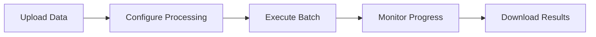

# Core Concepts

Understanding these core concepts will help you get the most out of PLai Framework and build effective AI agent systems.

## Projects & Organizations

<CardGroup cols={2}>
  <Card title="Organizations" icon="building">
    Top-level containers that group users, projects, and billing
  </Card>
  <Card title="Projects" icon="folder">
    Workspaces containing agents, tools, and datasources
  </Card>
</CardGroup>

### Organization Structure
Organizations provide:
- **Team Management**: Invite and manage team members
- **Billing**: Centralized billing and usage tracking
- **Access Control**: Organization-level permissions
- **Resource Sharing**: Share resources across projects

### Projects
Projects are isolated workspaces where you:
- Create and manage agents
- Configure tools and datasources
- Process batches
- Monitor usage and performance

## Agents

Agents are the core AI entities in PLai Framework. Each agent is a specialized AI assistant with its own configuration, tools, and capabilities.

<Tabs>
  <Tab title="Agent Properties">
    - **Name & Description**: Human-readable identification
    - **Model Configuration**: LLM provider and model selection
    - **System Instructions**: Base personality and behavior
    - **Tools**: Available capabilities and integrations
    - **Datasources**: Access to knowledge bases
    - **Guardrails**: Safety and compliance controls
  </Tab>
  <Tab title="Agent Types">
    - **Customer Support**: Handle inquiries and tickets
    - **Data Analysis**: Process and analyze data
    - **Content Generation**: Create and edit content
    - **Research**: Gather and synthesize information
    - **Automation**: Execute workflows and processes
  </Tab>
</Tabs>

## Tools

Tools extend agent capabilities by connecting them to external systems and services.

### Tool Categories

<AccordionGroup>
  <Accordion title="Communication Tools">
    - **API Requests**: Connect to REST APIs
    - **Web Search**: Perplexity AI integration
    - **Browser**: Web scraping and automation
  </Accordion>
  <Accordion title="Processing Tools">
    - **Code Interpreter**: Execute code securely
    - **MCP Servers**: Model Context Protocol integrations
    - **External Datasources**: Database connections
  </Accordion>
</AccordionGroup>

### Tool Status Levels
- **Default**: Production-ready, available to all users
- **Pro**: Advanced features for premium users
- **Alpha**: Early access, features may change

## Datasources

Datasources provide agents with access to knowledge bases, documents, and structured data.

### Supported Datasource Types
- **File Uploads**: PDFs, text files, documents
- **Web Scraping**: Extract data from websites
- **Database Connections**: SQL and NoSQL databases
- **API Integrations**: Real-time data from external services

## Analytics & Monitoring

PLai Framework provides comprehensive analytics to help you understand and optimize agent performance.

### Key Metrics
- **Conversation Volume**: Number of interactions
- **Response Times**: Agent performance metrics
- **Success Rates**: Goal completion tracking
- **Cost Analysis**: Usage-based billing insights
- **Error Rates**: System reliability monitoring

### Analytics Components
- **Progress Tracking**: Real-time analysis status
- **Custom Filters**: Filter data by various criteria
- **Report Generation**: Automated reporting
- **Settings Panel**: Configure analysis parameters

## Batches

Batches enable processing large volumes of data or requests efficiently.

### Batch Processing Flow

### Batch Features
- **Bulk Processing**: Handle thousands of requests
- **Status Tracking**: Real-time progress monitoring
- **Error Handling**: Automatic retry and error reporting
- **Result Export**: Download processed data

## Security & Compliance

### Access Control
- **Role-Based Access Control (RBAC)**: Fine-grained permissions
- **Project-Level Permissions**: Control access to resources
- **API Authentication**: Secure API access with JWT tokens

### Data Protection
- **Encryption**: Data encrypted in transit and at rest
- **Audit Logs**: Complete activity tracking
- **Data Retention**: Configurable data lifecycle policies

### Guardrails
Guardrails ensure agents operate safely and within defined boundaries:
- **Content Filtering**: Prevent inappropriate responses
- **Rate Limiting**: Control usage and costs
- **Safety Checks**: Validate inputs and outputs
- **Compliance**: Meet regulatory requirements

## Model Context Protocol (MCP)

MCP enables agents to connect to external tools and services through a standardized protocol.

### MCP Benefits
- **Standardization**: Consistent interface for tools
- **Extensibility**: Easy integration of new capabilities
- **Security**: Secure communication between components
- **Scalability**: Support for distributed architectures

### MCP Server Types
- **Remote Servers**: Cloud-based MCP implementations
- **Local Servers**: Self-hosted MCP services
- **Hybrid**: Mix of remote and local servers

## Best Practices

<Tip>
**Start Simple**: Begin with basic agents and gradually add complexity as you learn the platform.
</Tip>

<Tip>
**Monitor Performance**: Use analytics to understand agent behavior and optimize performance.
</Tip>

<Warning>
**Security First**: Always implement appropriate guardrails and access controls for production deployments.
</Warning>

<Note>
**Cost Management**: Monitor usage and set up billing alerts to manage costs effectively.
</Note>

## Next Steps

Now that you understand the core concepts, you're ready to:

<CardGroup cols={2}>
  <Card title="Create Your First Agent" icon="play" href="/quickstart">
    Follow the quickstart guide
  </Card>
  <Card title="Explore Agent Features" icon="robot" href="/agents/overview">
    Learn about agent capabilities
  </Card>
  <Card title="Configure Tools" icon="wrench" href="/tools/overview">
    Set up agent tools
  </Card>
  <Card title="View Tutorials" icon="graduation-cap" href="/guides/first-agent">
    Step-by-step guides
  </Card>
</CardGroup>