# Welcome to PLai Framework

PLai Framework is a comprehensive low-code platform for building and deploying AI multi-agent systems. Whether you're creating customer service bots, data analysis agents, or complex automation workflows, PLai provides the tools and infrastructure you need.

<Frame>
  
</Frame>

## What is PLai Framework?

PLai Framework enables you to:

<CardGroup cols={2}>
  <Card title="🤖 Create AI Agents" icon="robot">
    Build sophisticated agents with analytics, filters, and guardrails
  </Card>
  <Card title="🔧 Use Powerful Tools" icon="wrench">
    Connect to APIs, browsers, code interpreters, and MCP servers
  </Card>
  <Card title="📊 Monitor Performance" icon="chart-line">
    Track usage, billing, and performance metrics in real-time
  </Card>
  <Card title="📋 Process in Batches" icon="list-check">
    Handle large-scale processing with batch operations
  </Card>
</CardGroup>

## Core Features

### Multi-Agent Architecture
Deploy multiple specialized agents that can work together or independently, each with their own configuration, tools, and capabilities.

### Extensive Tool Integration
Choose from 6+ tool types including:
- **API Requests**: Connect to any REST API
- **Perplexity AI**: Web search and research capabilities  
- **MCP Servers**: Model Context Protocol integrations
- **Browser Tools**: Web scraping and automation
- **Code Interpreter**: Execute code in secure environments
- **External Datasources**: Database and data source connections

### Advanced Analytics & Monitoring
- Real-time conversation analytics
- Performance tracking and reporting
- Billing and usage monitoring
- Custom filters and guardrails

### Enterprise Ready
- Role-based access control (RBAC)
- Team collaboration features
- Billing management
- Production-grade infrastructure

## Architecture Overview

```mermaid
graph TB
    A[PLai Framework] --> B[🤖 Agents]
    A --> C[🔧 Tools] 
    A --> D[🗄️ Datasources]
    A --> E[📋 Batches]
    A --> F[📊 Monitor]
    
    B --> B1[Analytics & Reporting]
    B --> B2[Answer Filters]
    B --> B3[Safety Guardrails]
    B --> B4[Model Configuration]
    
    C --> C1[API Requests]
    C --> C2[Web Search]
    C --> C3[Browser Automation]
    C --> C4[Code Execution]
    
    F --> F1[Usage Analytics]
    F --> F2[Performance Metrics]
    F --> F3[Billing Summary]
```

## Getting Started

Ready to build your first AI agent? Let's get started!

<Card title="Quick Start Guide" icon="play" href="/quickstart">
  Get your first agent running in under 5 minutes
</Card>

## Explore the Documentation

<CardGroup cols={3}>
  <Card title="Core Concepts" icon="book" href="/concepts">
    Learn the fundamental concepts and terminology
  </Card>
  <Card title="Step-by-Step Guides" icon="graduation-cap" href="/guides/first-agent">
    Follow detailed tutorials for common scenarios
  </Card>
  <Card title="API Reference" icon="code" href="/api-reference/introduction">
    Complete API documentation and examples
  </Card>
</CardGroup>

## Popular Use Cases

<Accordion title="Customer Support Automation">
  Build intelligent customer support agents that can handle inquiries, access knowledge bases, and escalate complex issues to human agents.
</Accordion>

<Accordion title="Data Analysis & Reporting">
  Create agents that can analyze data from multiple sources, generate reports, and provide insights through natural language interfaces.
</Accordion>

<Accordion title="Content Generation & Research">
  Deploy agents that can research topics, generate content, and fact-check information using web search and document analysis.
</Accordion>

<Accordion title="Process Automation">
  Automate complex business processes by combining multiple tools and agents that can interact with different systems.
</Accordion>

## Need Help?

<CardGroup cols={2}>
  <Card title="Join Our Community" icon="discord" href="https://discord.gg/plaisolutions">
    Connect with other developers and get help from the community
  </Card>
  <Card title="Contact Support" icon="life-ring" href="mailto:support@plaisolutions.com">
    Get direct support from our team
  </Card>
</CardGroup>
