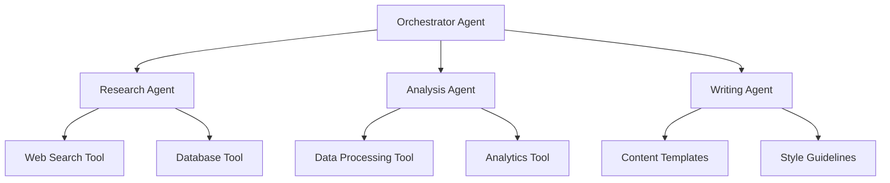
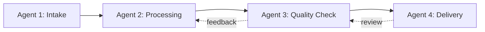
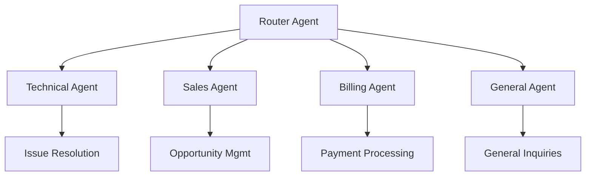
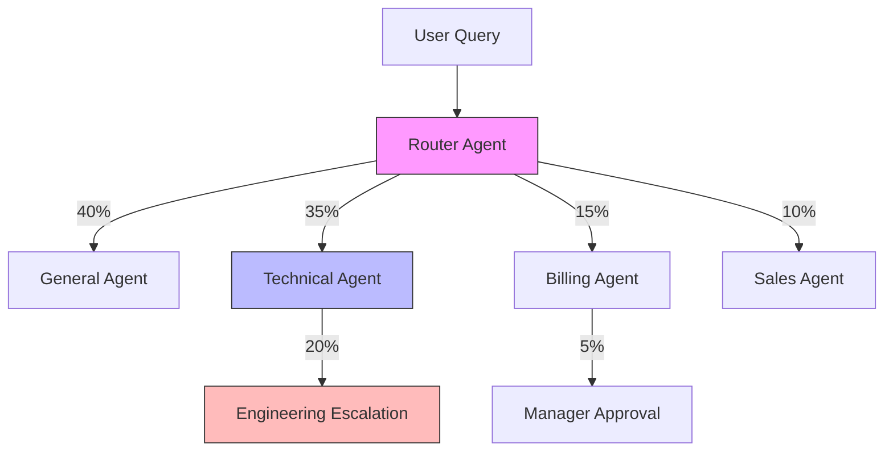

# Agent Tool

The Agent Tool enables your agents to invoke and collaborate with other agents, creating powerful multi-agent workflows and specialized task delegation. This tool transforms individual agents into a coordinated team of AI specialists.

<Note>
This tool has **Default** status, meaning it's production-ready and available on all subscription plans.
</Note>

## Overview

The Agent Tool creates a powerful multi-agent architecture where agents can:

<CardGroup cols={2}>
  <Card title="Agent Orchestration" icon="sitemap">
    Coordinate multiple specialized agents for complex tasks
  </Card>
  <Card title="Task Delegation" icon="hand-point-right">
    Delegate specific subtasks to expert agents
  </Card>
  <Card title="Knowledge Sharing" icon="share-nodes">
    Share context and information between agents
  </Card>
  <Card title="Workflow Automation" icon="diagram-project">
    Build sophisticated multi-step agent workflows
  </Card>
</CardGroup>

## Configuration Parameters

<ParamField path="target_agent_id" type="select" required>
  The agent to invoke when this tool is used
  <br />**Options**:
  - Project agents - Agents created in your current project
  - Core agents - System-wide specialized agents
  <br />**Note**: The target agent must be active and configured properly
</ParamField>

## Setup Instructions

<Steps>
  <Step title="Create Target Agent">
    First, ensure you have created and configured the agent you want to invoke
  </Step>
  <Step title="Navigate to Tools">
    Go to the **Tools** section in your project dashboard
  </Step>
  <Step title="Create Agent Tool">
    Click **Create Tool** and select **Agent Tool**
  </Step>
  <Step title="Configure Tool Details">
    Provide a descriptive name and description for the tool
  </Step>
  <Step title="Select Target Agent">
    Choose the agent you want to invoke from the dropdown list
  </Step>
  <Step title="Test Agent Tool">
    Use the test button to verify the agent invocation works correctly
  </Step>
  <Step title="Add to Parent Agent">
    Assign this tool to the orchestrator or parent agent that will use it
  </Step>
</Steps>

## Agent Types

### Project Agents

Custom agents created within your project:

<Tabs>
  <Tab title="Characteristics">
    - **Custom Configuration**: Tailored to your specific needs
    - **Project-Scoped**: Available only within the current project
    - **Full Control**: Complete control over prompts and settings
    - **Flexible**: Can be modified and optimized as needed
  </Tab>
  <Tab title="Best For">
    - Industry-specific workflows
    - Custom business logic
    - Proprietary processes
    - Specialized domain expertise
    - Project-specific requirements
  </Tab>
  <Tab title="Examples">
    - Sales qualification agent
    - Technical support specialist
    - Content review agent
    - Data validation agent
    - Custom reporting agent
  </Tab>
</Tabs>

### Core Agents

System-wide specialized agents available across projects:

<Tabs>
  <Tab title="Characteristics">
    - **Pre-Configured**: Ready to use with optimal settings
    - **System-Wide**: Available across all projects
    - **Maintained**: Regularly updated and improved
    - **Specialized**: Designed for specific common tasks
  </Tab>
  <Tab title="Best For">
    - Common workflows
    - Standard operations
    - General-purpose tasks
    - Cross-project functionality
    - Proven patterns
  </Tab>
  <Tab title="Examples">
    - Text summarization agent
    - Language translation agent
    - Sentiment analysis agent
    - Data extraction agent
    - Classification agent
  </Tab>
</Tabs>

## Configuration Examples

### Customer Support Escalation

```json
{
  "name": "Escalate to Specialist",
  "description": "Escalates complex technical issues to the specialized technical support agent",
  "target_agent_id": "tech_support_specialist_agent_id"
}
```

**Use Case**: A general support agent can escalate technical questions to a specialized technical support agent with deep product knowledge.

### Multi-Language Support

```json
{
  "name": "Spanish Translation Agent",
  "description": "Translates responses to Spanish for Spanish-speaking customers",
  "target_agent_id": "spanish_translation_agent_id"
}
```

**Use Case**: An English-speaking agent can invoke a translation agent to provide responses in Spanish.

### Data Analysis Pipeline

```json
{
  "name": "Financial Analysis Agent",
  "description": "Performs detailed financial analysis on the provided data",
  "target_agent_id": "financial_analyst_agent_id"
}
```

**Use Case**: A general business intelligence agent can delegate financial analysis to a specialized financial analyst agent.

### Content Generation Workflow

```json
{
  "name": "SEO Content Optimizer",
  "description": "Optimizes content for SEO best practices",
  "target_agent_id": "seo_optimizer_agent_id"
}
```

**Use Case**: A content creation agent can invoke an SEO specialist to optimize generated content.

## Multi-Agent Architectures

### Hierarchical Architecture



**Pattern**: Single orchestrator delegates to specialized agents
**Benefits**: Clear responsibility, easy to maintain
**Use Cases**: Customer service workflows, content creation pipelines

### Collaborative Architecture



**Pattern**: Agents pass work sequentially with feedback loops
**Benefits**: Quality control, iterative improvement
**Use Cases**: Document processing, data validation workflows

### Specialist Pool Architecture



**Pattern**: Router agent directs to appropriate specialist
**Benefits**: Efficient routing, specialized expertise
**Use Cases**: Customer support, ticketing systems

## Use Cases & Applications

### Customer Support Tiers

```yaml
Architecture: Hierarchical escalation system
Agents:
  Tier 1: General Support Agent
    Tools:
      - Knowledge base search
      - FAQ lookup
      - Escalate to Tier 2 (Agent Tool)
  
  Tier 2: Technical Support Agent
    Tools:
      - System diagnostics
      - Advanced troubleshooting
      - Escalate to Tier 3 (Agent Tool)
  
  Tier 3: Engineering Support Agent
    Tools:
      - Code analysis
      - System access
      - Bug tracking integration

Benefits:
  - Appropriate expertise level
  - Efficient resource usage
  - Better resolution rates
  - Customer satisfaction
```

### Content Creation Pipeline

```yaml
Architecture: Sequential workflow with quality gates
Agents:
  1. Research Agent:
     - Gathers information from multiple sources
     - Compiles research summary
     - Passes to Content Agent
  
  2. Content Creation Agent:
     - Writes draft content
     - Applies brand guidelines
     - Passes to SEO Agent
  
  3. SEO Optimization Agent:
     - Optimizes keywords
     - Checks readability
     - Passes to Review Agent
  
  4. Quality Review Agent:
     - Fact-checks content
     - Ensures quality standards
     - Approves or sends back for revision

Benefits:
  - Specialized expertise at each stage
  - Quality assurance built-in
  - Scalable content production
  - Consistent output quality
```

### Sales Qualification Workflow

```yaml
Architecture: Decision-tree routing
Agents:
  Initial Contact Agent:
    - Collects basic information
    - Assesses prospect fit
    - Routes to appropriate specialist
    
  SMB Sales Agent (for small businesses):
    - Self-service product demos
    - Quick pricing quotes
    - Automated onboarding
  
  Enterprise Sales Agent (for large companies):
    - Custom solution design
    - Executive presentations
    - Contract negotiation support
  
  Partner Sales Agent (for resellers):
    - Partner program information
    - Margin calculations
    - Channel support

Benefits:
  - Appropriate sales approach
  - Better conversion rates
  - Efficient use of sales resources
  - Improved customer experience
```

### Data Processing Pipeline

```yaml
Architecture: Parallel processing with aggregation
Agents:
  Orchestrator Agent:
    - Receives data processing request
    - Splits work across specialist agents
    - Aggregates results
  
  Data Validation Agent:
    - Validates data format
    - Checks data quality
    - Flags anomalies
  
  Data Transformation Agent:
    - Cleanses data
    - Normalizes formats
    - Enriches data
  
  Data Analysis Agent:
    - Performs statistical analysis
    - Generates insights
    - Creates visualizations
  
  Reporting Agent:
    - Compiles final report
    - Formats output
    - Delivers results

Benefits:
  - Parallel processing for speed
  - Specialized data handling
  - Quality assurance
  - Comprehensive reporting
```

## Context Passing & Data Flow

### Input Context

When an agent invokes another agent through the Agent Tool:

```json
{
  "input": "User's question or task",
  "context": {
    "conversation_history": "Previous messages in the thread",
    "user_information": "Relevant user data",
    "session_data": "Current session context",
    "parent_agent_findings": "Results from parent agent"
  },
  "metadata": {
    "originating_agent": "parent_agent_id",
    "conversation_id": "thread_id",
    "timestamp": "2024-01-15T10:30:00Z"
  }
}
```

### Response Format

The invoked agent returns:

```json
{
  "output": "Agent's response or result",
  "confidence": 0.92,
  "sources": [
    {"type": "knowledge_base", "id": "doc_123"},
    {"type": "tool_execution", "tool": "database_query"}
  ],
  "suggested_actions": [
    "follow_up_question",
    "escalate_to_human"
  ],
  "execution_metadata": {
    "duration_ms": 1250,
    "tokens_used": 450,
    "tools_invoked": ["database", "api_request"]
  }
}
```

## Best Practices

### Agent Design

<Tip>
**Single Responsibility**: Design each agent with a specific, well-defined purpose for better reliability and maintainability.
</Tip>

- **Clear Objectives**: Define precise goals for each agent
- **Focused Expertise**: Limit each agent's scope to specific tasks
- **Consistent Interfaces**: Standardize how agents communicate
- **Error Handling**: Implement robust error handling and fallbacks
- **Testing**: Thoroughly test agent interactions

### Context Management

```yaml
Do's:
  ✅ Pass relevant context to invoked agents
  ✅ Filter unnecessary information
  ✅ Maintain conversation history
  ✅ Track agent invocation chain
  ✅ Preserve user preferences

Don'ts:
  ❌ Pass all context indiscriminately
  ❌ Lose important conversation context
  ❌ Create circular agent invocations
  ❌ Ignore context size limits
  ❌ Forget to handle context overflow
```

### Performance Optimization

<AccordionGroup>
  <Accordion title="Minimize Agent Hops">
    **Issue**: Multiple agent invocations increase latency
    **Solution**: Design direct paths to specialist agents
    **Example**: Instead of A→B→C, allow A to directly invoke C when appropriate
  </Accordion>
  <Accordion title="Parallel Processing">
    **Issue**: Sequential agent calls are slow
    **Solution**: Invoke independent agents in parallel
    **Example**: Run data validation and enrichment agents simultaneously
  </Accordion>
  <Accordion title="Caching Strategies">
    **Issue**: Redundant agent invocations waste resources
    **Solution**: Cache agent responses for common queries
    **Example**: Cache translation results, frequently used analyses
  </Accordion>
  <Accordion title="Agent Selection Logic">
    **Issue**: Poor routing leads to multiple handoffs
    **Solution**: Implement smart routing based on query analysis
    **Example**: Analyze query intent before selecting specialist agent
  </Accordion>
</AccordionGroup>

### Security Considerations

<Warning>
**Access Control**: Ensure agents only invoke other agents they have permission to access. Prevent unauthorized agent chains.
</Warning>

- **Permission Boundaries**: Define clear permission boundaries
- **Audit Logging**: Log all agent invocations for security audits
- **Data Privacy**: Ensure sensitive data is handled appropriately
- **Rate Limiting**: Prevent agent invocation abuse <Badge color="orange">IN PROGRESS</Badge>
- **Monitoring**: Monitor for unusual agent invocation patterns

## Monitoring & Analytics

### Key Metrics

Track important multi-agent performance indicators:

```yaml
Performance Metrics:
  - Agent invocation frequency
  - Average response time per agent
  - Success rate of agent handoffs
  - Context preservation accuracy
  - End-to-end workflow duration

Quality Metrics:
  - Task completion rate
  - Escalation rate
  - User satisfaction scores
  - Error rates per agent
  - Retry and fallback frequency

Efficiency Metrics:
  - Agent utilization rates
  - Average handoff count
  - Resource consumption per workflow
  - Cost per completed task
  - Parallelization opportunities
```

### Workflow Visualization

Monitor agent interaction patterns:



## Troubleshooting

### Common Issues

<AccordionGroup>
  <Accordion title="Agent Not Found">
    **Symptoms**: Target agent cannot be invoked
    **Solutions**:
    - Verify target agent ID is correct
    - Ensure target agent is active
    - Check agent permissions
    - Confirm agent exists in project or core agents
  </Accordion>
  <Accordion title="Context Loss">
    **Symptoms**: Invoked agent lacks necessary context
    **Solutions**:
    - Verify context is being passed correctly
    - Check context size limits
    - Ensure conversation history is maintained
    - Review agent input configuration
  </Accordion>
  <Accordion title="Circular Invocations">
    **Symptoms**: Agents invoking each other in loops
    **Solutions**:
    - Implement invocation depth limits
    - Add circular reference detection
    - Review agent tool configuration
    - Redesign agent workflow to prevent loops
  </Accordion>
  <Accordion title="Performance Issues">
    **Symptoms**: Slow multi-agent workflows
    **Solutions**:
    - Optimize agent invocation paths
    - Implement parallel processing
    - Cache frequent agent responses
    - Reduce unnecessary agent hops
  </Accordion>
</AccordionGroup>

## Advanced Patterns

### Consensus Building

Multiple agents collaborate to reach consensus:

```yaml
Pattern: Ensemble Decision Making
Process:
  1. Orchestrator presents problem to multiple specialist agents
  2. Each agent provides independent analysis
  3. Orchestrator aggregates responses
  4. Final decision based on consensus or weighted voting

Benefits:
  - Reduced bias
  - Higher accuracy
  - Multiple perspectives
  - Quality assurance

Example Use Cases:
  - Content moderation
  - Risk assessment
  - Medical diagnosis support
  - Investment decisions
```

### Dynamic Agent Selection

Smart routing based on query analysis:

```yaml
Pattern: Intelligent Router
Process:
  1. Analyze incoming query/request
  2. Extract key attributes (complexity, domain, urgency)
  3. Score available agents against attributes
  4. Select optimal agent dynamically
  5. Monitor performance and adjust routing

Benefits:
  - Optimal resource allocation
  - Better first-contact resolution
  - Adaptive system
  - Load balancing

Example Use Cases:
  - Customer support routing
  - Task assignment
  - Dynamic pricing quotes
  - Workload distribution
```

### Agent Specialization Layers

Progressively specialized agents:

```yaml
Pattern: Expertise Pyramid
Layers:
  Layer 1 - Generalist:
    - Handles 70% of queries
    - Routes complex cases upward
    
  Layer 2 - Domain Specialists:
    - Handles 25% of queries
    - Deep domain knowledge
    
  Layer 3 - Expert Consultants:
    - Handles 5% of queries
    - Highest expertise level
    - May involve human experts

Benefits:
  - Efficient triage
  - Cost optimization
  - Quality assurance
  - Scalability

Example Use Cases:
  - Medical consultation
  - Legal advice
  - Technical support
  - Financial planning
```

## Next Steps

<CardGroup cols={2}>
  <Card title="Create Your First Agent Tool" icon="play" href="/guides/first-agent">
    Set up agent-to-agent communication
  </Card>
  <Card title="Multi-Agent Patterns" icon="diagram-project" href="/guides/multi-agent-patterns">
    Learn advanced multi-agent architectures
  </Card>
  <Card title="Other Tools" icon="grid" href="/tools/overview">
    Explore other available tools
  </Card>
  <Card title="API Reference" icon="code" href="/api-reference/tools">
    View the tools API documentation
  </Card>
</CardGroup>
