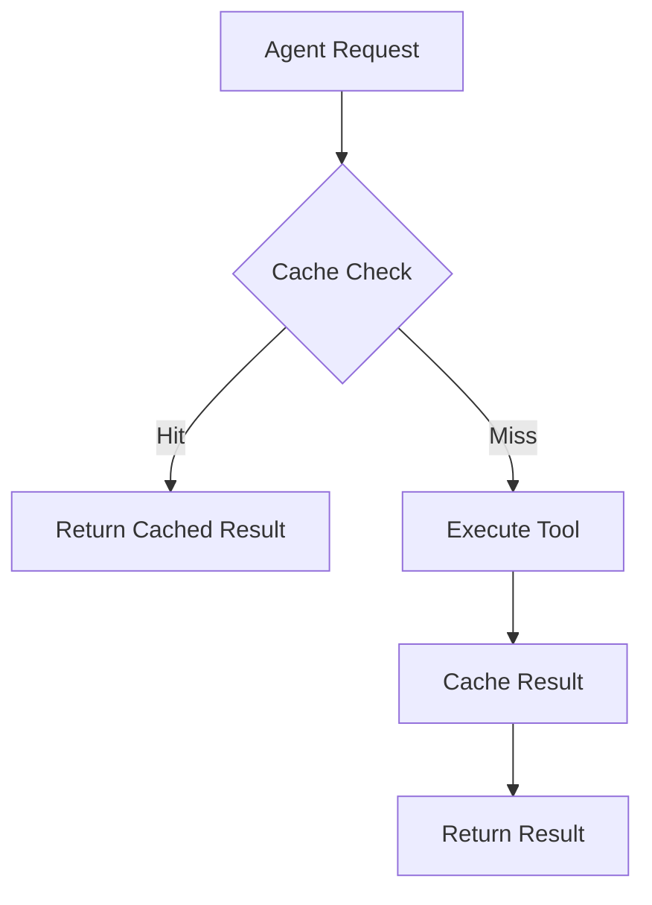

# Tools Overview

Tools are the building blocks that give your agents the ability to interact with external systems, process data, and perform complex operations. PLai Framework supports 6 different tool types, each designed for specific use cases.

<Frame>
  
</Frame>

## Available Tool Types

<CardGroup cols={2}>
  <Card title="API Request" icon="cloud" href="/tools/api-requests">
    Make HTTP requests to any REST API with full configuration control
    <Badge variant="default">Default</Badge>
  </Card>
  <Card title="Perplexity AI" icon="magnifying-glass" href="/tools/perplexity-ai">
    Web search and research capabilities powered by Perplexity AI
    <Badge variant="pro">Pro</Badge>
  </Card>
  <Card title="MCP Server" icon="server" href="/tools/mcp-servers">
    Connect to Model Context Protocol servers for extended functionality
    <Badge variant="preview">Preview</Badge>
  </Card>
  <Card title="Browser" icon="globe" href="/tools/browser-tools">
    Web scraping and browser automation with ScraperAPI integration
    <Badge variant="default">Default</Badge>
  </Card>
  <Card title="External Data Source" icon="database" href="/tools/external-datasource">
    Connect to external databases and data sources
    <Badge variant="pro">Pro</Badge>
  </Card>
  <Card title="Code Interpreter" icon="code" href="/tools/code-interpreter">
    Execute code in a secure sandboxed environment
    <Badge variant="alpha">Alpha</Badge>
  </Card>
</CardGroup>

## Tool Status Levels

Understanding tool maturity helps you make informed decisions:

<Tabs>
  <Tab title="Default">
    - **Production Ready**: Thoroughly tested and stable
    - **Full Support**: Complete documentation and support
    - **All Plans**: Available on all subscription tiers
    - **Examples**: API Request, Browser Tools
  </Tab>
  <Tab title="Pro">
    - **Advanced Features**: Enhanced capabilities for premium users
    - **Pro Plans Only**: Requires professional subscription
    - **Priority Support**: Dedicated support channels
    - **Examples**: Perplexity AI, External Datasource
  </Tab>
  <Tab title="Alpha">
    - **Early Access**: Latest features under development
    - **May Change**: Features and APIs subject to modification
    - **Beta Testing**: Help us improve with feedback
    - **Examples**: Code Interpreter
  </Tab>
  <Tab title="Preview">
    - **Preview Release**: Nearly ready for production
    - **Feedback Welcome**: Share your experience
    - **Limited Changes**: Minor adjustments possible
    - **Examples**: MCP Server
  </Tab>
</Tabs>

## Tool Categories

### Communication Tools

Tools that enable agents to interact with external services and APIs:

<AccordionGroup>
  <Accordion title="API Request Tool">
    **Purpose**: Connect to any REST API endpoint
    
    **Key Features**:
    - Custom HTTP methods (GET, POST, PUT, DELETE)
    - Flexible header configuration
    - Request body templating
    - Response parsing and handling
    
    **Use Cases**:
    - CRM integration (Salesforce, HubSpot)
    - Payment processing (Stripe, PayPal)
    - Notification services (Slack, Discord)
    - Custom internal APIs
  </Accordion>
  <Accordion title="Perplexity AI Tool">
    **Purpose**: Web search and research capabilities
    
    **Key Features**:
    - Multiple model options (Sonar, Sonar Pro, Sonar Reasoning)
    - Domain-specific search filtering
    - Real-time web information
    - Citation and source tracking
    
    **Use Cases**:
    - Market research
    - News and current events
    - Fact-checking
    - Competitive analysis
  </Accordion>
</AccordionGroup>

### Processing Tools

Tools that enable data processing and code execution:

<AccordionGroup>
  <Accordion title="Browser Tool">
    **Purpose**: Web scraping and browser automation
    
    **Key Features**:
    - ScraperAPI integration for reliable scraping
    - JavaScript rendering support
    - Beautiful Soup for HTML parsing
    - Rate limiting and proxy support
    
    **Use Cases**:
    - Price monitoring
    - Content extraction
    - Website testing
    - Data collection
  </Accordion>
  <Accordion title="Code Interpreter">
    **Purpose**: Execute code in secure environments
    
    **Key Features**:
    - Multiple language support
    - Sandboxed execution
    - File system access
    - Output capture and formatting
    
    **Use Cases**:
    - Data analysis
    - Mathematical calculations
    - Report generation
    - Algorithm implementation
  </Accordion>
</AccordionGroup>

### Data Tools

Tools that provide access to external data sources:

<AccordionGroup>
  <Accordion title="External Datasource">
    **Purpose**: Connect to databases and data sources
    
    **Key Features**:
    - Multiple database support (SQL, NoSQL)
    - Secure connection management
    - Query optimization
    - Real-time data access
    
    **Use Cases**:
    - Customer data lookup
    - Inventory management
    - Analytics and reporting
    - Data synchronization
  </Accordion>
  <Accordion title="MCP Server">
    **Purpose**: Model Context Protocol server integration
    
    **Key Features**:
    - Standardized protocol support
    - OAuth and token authentication
    - Remote server connections
    - Extensible architecture
    
    **Use Cases**:
    - Custom tool development
    - Enterprise integrations
    - Third-party service connections
    - Distributed architectures
  </Accordion>
</AccordionGroup>

## Tool Configuration

### General Configuration Process

All tools follow a similar configuration pattern:

<Steps>
  <Step title="Select Tool Type">
    Choose the appropriate tool type for your use case
  </Step>
  <Step title="Configure Parameters">
    Fill in required and optional configuration parameters
  </Step>
  <Step title="Test Connection">
    Verify the tool works correctly with test inputs
  </Step>
  <Step title="Add to Agent">
    Assign the tool to one or more agents
  </Step>
  <Step title="Monitor Usage">
    Track tool performance and usage through analytics
  </Step>
</Steps>

### Common Configuration Options

Most tools share these configuration elements:

- **Name**: Human-readable identifier for the tool
- **Description**: Purpose and functionality summary
- **Authentication**: API keys, tokens, or credentials
- **Rate Limits**: Request throttling and usage controls
- **Error Handling**: Retry logic and fallback options
- **Logging**: Activity tracking and debugging info

## Tool Security

### Authentication Methods

<CardGroup cols={3}>
  <Card title="API Keys" icon="key">
    Simple key-based authentication for most APIs
  </Card>
  <Card title="OAuth 2.0" icon="shield">
    Secure token-based authentication for enterprise APIs
  </Card>
  <Card title="Basic Auth" icon="lock">
    Username/password authentication for legacy systems
  </Card>
</CardGroup>

### Security Best Practices

<Warning>
**Credential Security**: Never expose API keys or credentials in tool descriptions or logs.
</Warning>

<Tip>
**Environment Variables**: Use environment variables or secure vaults for sensitive credentials.
</Tip>

- **Rotate Credentials**: Regularly update API keys and access tokens
- **Minimal Permissions**: Grant only necessary permissions to tools
- **Monitor Usage**: Track tool usage for unusual activity
- **Audit Logs**: Maintain logs of all tool interactions

## Performance Optimization

### Caching Strategies

Tools can implement various caching mechanisms:



### Rate Limiting

Effective rate limiting strategies:

- **Tool-Level Limits**: Per-tool rate limiting
- **Agent-Level Limits**: Per-agent usage controls
- **Organization-Level Limits**: Global usage caps
- **Dynamic Adjustment**: Automatic limit adjustment based on usage

## Troubleshooting

### Common Issues

<AccordionGroup>
  <Accordion title="Authentication Failures">
    **Symptoms**: 401 or 403 errors, access denied messages
    
    **Solutions**:
    - Verify API keys and credentials
    - Check permission scopes
    - Confirm rate limits haven't been exceeded
    - Review authentication method configuration
  </Accordion>
  <Accordion title="Connection Timeouts">
    **Symptoms**: Request timeout errors, slow responses
    
    **Solutions**:
    - Check network connectivity
    - Increase timeout values
    - Implement retry logic
    - Use connection pooling
  </Accordion>
  <Accordion title="Data Format Issues">
    **Symptoms**: Parsing errors, unexpected responses
    
    **Solutions**:
    - Validate request/response formats
    - Check API documentation
    - Update tool configuration
    - Implement proper error handling
  </Accordion>
</AccordionGroup>

## Tool Development

### Custom Tool Creation

While PLai Framework provides built-in tools, you can extend functionality:

1. **MCP Server Development**: Create custom MCP servers for specialized functionality
2. **API Wrapper Tools**: Build tools that interact with specific APIs
3. **Data Processing Tools**: Develop tools for custom data transformations
4. **Integration Tools**: Create tools for enterprise system integration

### Tool Testing

Comprehensive testing ensures tool reliability:

```typescript
// Example tool test
describe('API Request Tool', () => {
  test('should make successful GET request', async () => {
    const tool = new APIRequestTool(config);
    const result = await tool.execute({
      method: 'GET',
      url: 'https://api.example.com/data'
    });
    
    expect(result.status).toBe(200);
    expect(result.data).toBeDefined();
  });
});
```

## Next Steps

<CardGroup cols={2}>
  <Card title="Create Your First Tool" icon="play" href="/tools/api-requests">
    Start with the API Request tool
  </Card>
  <Card title="Tool Configuration Guide" icon="settings" href="/guides/multi-tool-setup">
    Learn advanced tool configuration
  </Card>
  <Card title="Browse All Tools" icon="grid" href="/tools">
    Explore all available tool types
  </Card>
  <Card title="MCP Development" icon="code" href="/tools/mcp-servers">
    Build custom MCP servers
  </Card>
</CardGroup>